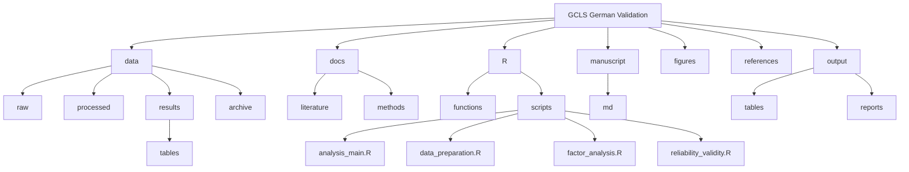

# German Validation of the Gender Congruence and Life Satisfaction Scale (G-GCLS)

This repository contains the validation study of the German version of the Gender Congruence and Life Satisfaction Scale (G-GCLS).

## Language Policy

- Project Communication/Chat: German
- Code and Documentation: English
- Analysis Outputs: English (APA Style)
- Manuscript: English (APA Style)
- Reference Materials: Original language (English/German)

## Project Structure



```
.
├── data/               # Data files
│   ├── raw/           # Original survey data (not tracked in git)
│   ├── processed/     # Cleaned and prepared data
│   ├── results/       # Analysis outputs
│   │   └── tables/    # Analysis tables (CSV, RData)
│   └── archive/       # Archived data files
├── docs/              # Documentation
│   ├── literature/    # Scientific publications
│   └── methods/       # Methodological documents
├── figures/           # Generated visualizations (300 DPI, APA style)
├── manuscript/        # Manuscript files
│   └── md/           # Markdown source
├── output/            # Final outputs for publication
│   ├── tables/       # Publication-ready tables
│   └── reports/      # HTML reports and visualizations
└── R/                 # R code
    ├── functions/     # Utility functions
    └── scripts/       # Analysis scripts
```

## Directory Guidelines

### Data Directory
- Raw data files containing personal information must not be committed to git
- File naming format: `YYYYMMDD_description.ext`
- All variable names in English
- Document data cleaning steps in processing scripts

### Documentation Directory
- Literature: Original research papers and publications
- Methods: Study protocols and methodological documents
- File naming format: `YYYY_author_description.ext`
- Version numbers included where applicable

### Figures Directory
- All figure text in English
- APA 7th Edition formatting
- Resolution: 300 DPI minimum
- Format: PNG for web, PDF for publication
- Font: Times New Roman
- Naming: `analysis_type_description_YYYYMMDD.ext`

### Output Directory
- `tables/`: Final, publication-ready tables (Markdown, LaTeX, PDF)
- `reports/`: HTML reports and visualizations for review
- All outputs follow APA 7th Edition guidelines

### R Code Directory
- All code comments in English
- Variable names in English
- Function documentation in English
- Output formatting follows APA 7th Edition guidelines

#### Structure
- `functions/`: Utility functions and helper code
  - `apa_style_utils.R`: Functions for APA-compliant output formatting
  
- `scripts/`: Analysis scripts
  - `analysis_main.R`: Main analysis coordinator
  - `data_preparation.R`: Data cleaning and preparation
  - `descriptive_analysis.R`: Descriptive statistics
  - `efa_prerequisites.R`: EFA assumptions checking
  - `factor_analysis.R`: Factor analysis implementation
  - `reliability_validity.R`: Reliability and validity analyses

#### Usage
All scripts are called from `analysis_main.R`. To run the complete analysis:

```R
source("R/scripts/analysis_main.R")
```

## Setup and Usage

1. Install R dependencies:
```r
# Install required R packages
install.packages("papaja")
install.packages(c("knitr", "kableExtra", "tidyverse", "psych"))
```

2. Install LaTeX:
   - Install a LaTeX distribution (e.g., TeX Live or MiKTeX)
   - XeLaTeX is required for Unicode support

3. Manuscript Compilation with papaja::apa6_pdf:

The template is configured in the manuscript's YAML header:

```yaml
output:
  papaja::apa6_pdf:
    citation_package: natbib
    latex_engine: xelatex
    includes:
      in_header: "../templates/apa7.tex"
```

The manuscript can be compiled in two ways:

a) In RStudio:
   - Open `manuscript/md/manuscript.Rmd`
   - Click "Knit"

b) Via command line:
```r
rmarkdown::render('manuscript/md/manuscript.Rmd')
```

### Troubleshooting

- Unicode issues: Use XeLaTeX engine
- Citation issues: Check BibTeX file for completeness
- Formatting issues: Check apa7.tex for conflicts

## Deutsche Installationshinweise (German Installation Notes)

### LaTeX-Installation
- Installieren Sie eine LaTeX-Distribution (z.B. TeX Live oder MiKTeX)
- XeLaTeX wird für die Unicode-Unterstützung benötigt

### Manuskript-Kompilierung
- In RStudio: Öffnen Sie `manuscript/md/manuscript.Rmd` und klicken Sie auf "Knit"
- Über Kommandozeile: Nutzen Sie `rmarkdown::render('manuscript/md/manuscript.Rmd')`

### Fehlerbehebung
- Unicode-Probleme: XeLaTeX-Engine verwenden
- Zitationsprobleme: BibTeX-Datei auf Vollständigkeit prüfen
- Formatierungsprobleme: apa7.tex auf Konflikte prüfen