# GCLS-Gv1.1 Recruitment Flowchart Data

## 📊 **Recruitment Steps & Numbers**

| **Step** | **Description** | **n** | **Undeliverable** | **Cumulative** |
|----------|-----------------|-------|-------------------|----------------|
| 1 | Transgender individuals (ICD-10: F64, 2001-2021) | 1161 | - | 1161 |
| 2 | Test run & questionnaire adjustment | 15 | - | 15 |
| 3 | First contact: Postal letter sent | 1146 | 332 | 1146 |
| 4 | Letter responses (Peak: 52 on 10.01.2023) | 52 | - | 52 |
| 5 | Second contact: E-Mail sent (20 days after) | - | 208 | - |
| 6 | E-Mail responses (Peak: 34 on 30.01.2023) | 59 | - | 111 |
| 7 | Third contact: SMS sent (30 days after) | - | 189 | - |
| 8 | SMS responses (Peak: 42 on 09.02.2023) | 42 | - | 153 |
| 9 | Additional responses until 15.02.2023 | 140 | - | 293 |
| **FINAL** | **Final sample** | **293** | - | **293 (25.2%)** |

---

## 🌊 **Mermaid Flowchart (Horizontal)**

```mermaid
flowchart LR
    A[1161 transgender individuals<br/>ICD-10: F64, 2001-2021] --> B[Test run<br/>N = 15]
    B --> C[Letter sent<br/>n = 1146<br/>undeliverable: 332]
    C --> D[Letter responses<br/>n = 52<br/>10.01.2023]
    D --> E[E-Mail sent<br/>20 days after<br/>undeliverable: 208]
    E --> F[E-Mail responses<br/>n = 59<br/>29-30.01.2023]
    F --> G[SMS sent<br/>30 days after<br/>undeliverable: 189]
    G --> H[SMS responses<br/>n = 42<br/>09.02.2023]
    H --> I[Additional responses<br/>n = 140<br/>until 15.02.2023]
    I --> J[Final sample<br/>n = 293<br/>25.2% response rate]
    
    style A fill:#e1f5fe
    style J fill:#c8e6c9
    style D fill:#ffecb3
    style F fill:#ffecb3
    style H fill:#ffecb3
```



---

## 📈 **Key Response Waves**

### **Wave 1: Letter (09.01.2023)**
- **Sent:** 1146 letters
- **Undeliverable:** 332
- **Peak response:** 52 (10.01.2023)
- **Response rate:** 4.5%

### **Wave 2: E-Mail (29.01.2023)**
- **Undeliverable:** 208
- **Peak response:** 34 (30.01.2023)
- **Total responses:** 59 over 2 days
- **Cumulative:** 111 (9.6%)

### **Wave 3: SMS (08.02.2023)**
- **Undeliverable:** 189
- **Peak response:** 42 (09.02.2023)
- **Cumulative:** 153 (13.2%)

### **Long-term Collection (until 15.02.2023)**
- **Additional:** 140 responses
- **Final total:** 293 (25.2%)

---

## 🎯 **Summary Statistics**

- **Initial database:** 1161 individuals
- **Contact attempts:** 3 waves (Letter → E-Mail → SMS)
- **Total undeliverable:** 729 contacts
- **Successful contacts:** ~432
- **Final participants:** 293
- **Overall response rate:** 25.2%
- **Collection period:** 37 days

---

## 📅 **Timeline**

```
2001-2021: Database creation (ICD-10: F64)
Pre-09.01: Test run (N=15)
09.01.2023: Letter sent
10.01.2023: Letter peak (52 responses)
29.01.2023: E-Mail sent (20 days after letter)
30.01.2023: E-Mail peak (34 responses)
08.02.2023: SMS sent (30 days after letter)
09.02.2023: SMS peak (42 responses)
15.02.2023: Data collection closed (293 total)
``` 