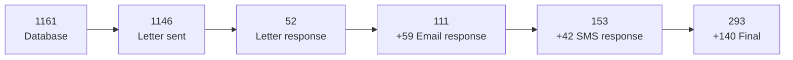
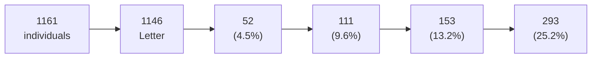
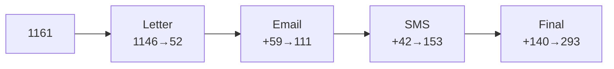
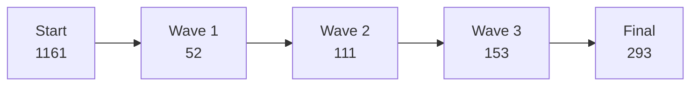
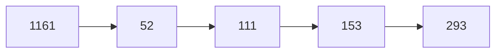

# GCLS Zahlen-fokussiertes Mermaid (ohne Test Run)

## 🔢 **Nur Zahlen - horizontales Mermaid**

## 📊 **Mit Response Rates:**

## 🎯 **Kompakt mit Methoden:**

## 📈 **Kumulative Entwicklung:**

## 🔄 **Ultra-clean:**

