# GCLS Zahlen-fokussiertes Mermaid (ohne Test Run)

## 🔢 **Nur Zahlen - horizontales Mermaid**

## 📊 **Mit Response Rates:**

## 🎯 **Kompakt mit Methoden:**

```mermaid
flowchart LR
    A[1161] --> B["Letter<br/>1146→52"]
    B --> C["Email<br/>+59→111"]
    C --> D["SMS<br/>+42→153"]
    D --> E["Final<br/>+140→293"]
```

## 📈 **Kumulative Entwicklung:**

## 🔄 **Ultra-clean:**

