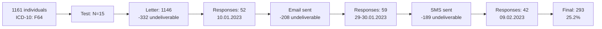
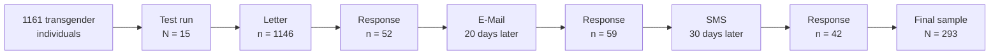
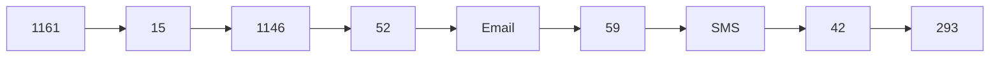
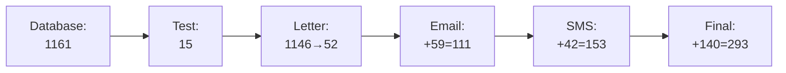

# GCLS Simple Mermaid Flowchart

## 🔄 **Einfaches horizontales Mermaid**

```mermaid
flowchart LR
    A[1161 individuals<br/>ICD-10: F64] --> B[Test: N=15]
    B --> C[Letter: 1146<br/>-332 undeliverable]
    C --> D[Responses: 52<br/>10.01.2023]
    D --> E[Email sent<br/>-208 undeliverable]
    E --> F[Responses: 59<br/>29-30.01.2023]
    F --> G[SMS sent<br/>-189 undeliverable]
    G --> H[Responses: 42<br/>09.02.2023]
    H --> I[Final: 293<br/>25.2%]
```

## 📋 **Für Manuscript/Präsentation:**

```mermaid
graph LR
    A["1161 transgender<br/>individuals"] --> B["Test run<br/>N = 15"]
    B --> C["Letter<br/>n = 1146"]
    C --> D["Response<br/>n = 52"]
    D --> E["E-Mail<br/>20 days later"]
    E --> F["Response<br/>n = 59"]
    F --> G["SMS<br/>30 days later"]
    G --> H["Response<br/>n = 42"]
    H --> I["Final sample<br/>N = 293"]
```

## 🎯 **Ultra-kompakt:**

```mermaid
flowchart LR
    A[1161] --> B[15] --> C[1146] --> D[52] --> E[Email] --> F[59] --> G[SMS] --> H[42] --> I[293]
```

## 📊 **Mit Zahlen fokussiert:**

```mermaid
flowchart LR
    A["Database:<br/>1161"] --> B["Test:<br/>15"]
    B --> C["Letter:<br/>1146→52"]
    C --> D["Email:<br/>+59=111"]
    D --> E["SMS:<br/>+42=153"]
    E --> F["Final:<br/>+140=293"]
``` 