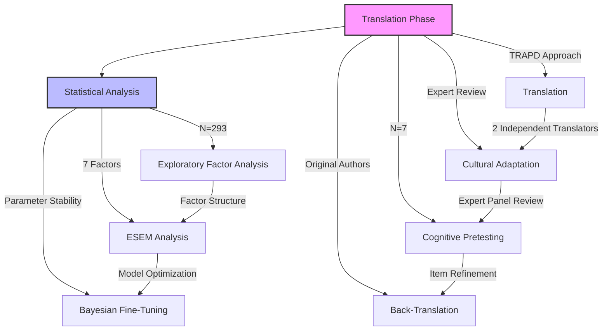

# Gender Congruence and Life Satisfaction Scale (GCLS): German Validation Study

Jan Ben Schulze¹*, Flavio Ammann¹, Bethany A. Jones²,³, Roland von Känel¹, & Sebastian Euler¹

¹Department of Consultation-Liaison Psychiatry and Psychosomatic Medicine, University Hospital Zurich, Switzerland

²Nottingham Centre for Transgender Health, United Kingdom

³School of Sport, Exercise and Health Sciences, Loughborough University, United Kingdom

*Corresponding author: Jan Ben Schulze, Department of Consultation-Liaison Psychiatry and Psychosomatic Medicine, University Hospital Zurich, Culmannstrasse 8, 8091 Zurich, Switzerland. Email: jan.schulze@usz.ch

## Abstract

**Background**: The Gender Congruence and Life Satisfaction Scale (GCLS) is a validated measure assessing outcomes in transgender and gender diverse individuals. A German version is needed to facilitate assessment and research in German-speaking healthcare settings.

**Methods**: We conducted a validation study of the German GCLS (G-GCLS) with 293 transgender and gender diverse participants (44.3% trans feminine, 33.3% non-binary, 16.7% trans masculine, 4.6% other). Following rigorous translation procedures, we performed exploratory factor analysis and assessed psychometric properties including internal consistency, convergent validity, and clinical utility.

**Results**: The G-GCLS demonstrated excellent internal consistency (Cronbach's α = .78-.90) and replicated the seven-factor structure of the original scale. Factor analysis revealed strong correspondence with the English version, particularly for the Chest (α = .84), Genitalia (α = .90), and Social Gender Role Recognition (α = .88) subscales. The data-driven exploratory factor analysis yielded good model fit (RMSEA = 0.054, 90% CI [0.048, 0.060]; TLI = 0.907) and explained 58.0% of total variance. Between-group comparisons showed distinct patterns of gender-affirming intervention utilization, with high rates of hormone therapy (97.3% AMAB, 96.8% AFAB) and notable differences in surgical procedures.

**Conclusion**: The results support the G-GCLS as a reliable and valid instrument for assessing gender congruence and life satisfaction in German-speaking transgender and gender diverse populations. The scale's robust psychometric properties and clinical utility make it suitable for both research and healthcare settings.

_Keywords:_ gender congruence, life satisfaction, scale validation, transgender health, psychometrics

## Introduction

The provision of healthcare for transgender individuals within the German-speaking healthcare systems is confronting existential challenges. Transgender people experience a fundamental incongruence between the sex assigned at birth and their lived gender identity, often identifying as gender-neutral, non-gender, or gender-queer (Arcelus and Bouman, 2017; Richards, Bouman and Barker, 2017; Richards et al., 2016). This discrepancy is frequently accompanied by significant distress, necessitating specialized and multidisciplinary treatment approaches (Beek, Kreukels, Cohen-Kettenis and Steensma, 2015).

Despite substantial progress achieved through gender-affirming interventions—which numerous studies document as yielding notable improvements in mental health and overall quality of life (Coleman et al., 2012; Wylie et al., 2014; Dhejne, Van Vlerken, Heylens and Arcelus, 2016; Jones, Haycraft, Murjan and Arcelus, 2016; Marshall, Claes, Bouman, Witcomb and Arcelus, 2016)—the evaluation of treatment outcomes has predominantly focused on psychological symptoms. This unidimensional approach fails to capture the complex, multifaceted needs of transgender individuals (Bouman et al., 2016, 2017; Heylens et al., 2014; Murad et al., 2010; Witcomb et al., 2018).

Moreover, the established measurement instruments—for instance, the Utrecht Gender Dysphoria Scale (Cohen-Kettenis and van Goozen, 1997) and the Hamburg Body Drawing Scale (Becker et al., 2016)—are generally based on a binary understanding of gender, thereby inadequately reflecting the growing diversity of transgender self-definitions (Beek et al., 2015; Clarke, Veale, Townsend, Frohard-Dourlent and Saewyc, 2018). In addition, the use of multiple questionnaires imposes a significant burden on respondents, which can detrimentally affect both participation rates and the validity and reliability of the collected data (Rolstad, Adler and Rydén, 2011; Turner et al., 2007; Diehr, Chen, Patrick, Feng and Yasui, 2005; Snyder et al., 2007).

A parallel methodological gap in the German-speaking region further exacerbates these issues. Although representative surveys are still lacking, estimates suggest that approximately 0.3-0.6% of the population may be transgender (Beek, Kreukels, Cohen-Kettenis and Steensma, 2015; Arcelus and Bouman, 2017). Without robust, representative data, key questions regarding need-based, patient-centered care—such as the appropriateness of treatment offerings and long-term care planning—remain largely unresolved. This underrepresentation renders the needs, psychosocial circumstances, and healthcare requirements of transgender individuals insufficiently visible and understood.

An innovative solution is offered by the "Gender Comprehensive Life Satisfaction Scale" (GCLS) developed in the English-speaking context by Jones et al. (2016). Unlike conventional measurement tools, the GCLS is built on a multidimensional model that integrates not only psychological symptoms but also aspects body perception, social participation, and overall life satisfaction. By incorporating extensive qualitative preliminary studies and advanced psychometric techniques—such as item response theory and factor analysis—a more refined construct validity and robust reliability have been achieved (Jones, Haycraft, Murjan and Arcelus, 2016; Marshall et al., 2016). Early pilot studies confirm that the GCLS effectively delineates nuanced differences in the life satisfaction dimensions of transgender individuals while simultaneously reducing the respondent burden through the consolidation of redundant measurement instruments (Dawson, Doll, Fitzpatrick, Jenkinson and Carr, 2010; Lawer et al., 2002).

Particularly in the German-speaking region, the introduction of a culturally and linguistically adapted German version of the GCLS is of paramount importance. Such an adaptation would bridge the current research gap by accounting not only for idiomatic nuances but also for country-specific healthcare infrastructures and social contexts. Only through the generation of reliable, robust data—which accurately reflects the complex care needs, avoids redundant measurement processes (Rolstad, Adler and Rydén, 2011; Turner et al., 2007), and facilitates the development of evidence-based, patient-centered care models (Richards et al., 2016; Bouman and Richards, 2013)—can the quality of healthcare for transgender individuals be sustainably improved.

## Methods

### Study Design

This validation study employed a cross-sectional design to evaluate the psychometric properties of the German version of the GCLS. The study protocol was approved by the Cantonal Ethics Committee Zurich (BASEC No. Req-2022-00630).

**Figure 1.** Workflow of the German GCLS validation process. The process consists of two main phases: Translation (pink) and Statistical Analysis (blue). _Note._ TRAPD = Translation, Review, Adjudication, Pretesting, and Documentation; EFA = Exploratory Factor Analysis; ESEM = Exploratory Structural Equation Modeling. Arrows indicate sequential progression. Numbers in parentheses indicate sample sizes (N). The translation phase involved multiple iterations of review and refinement, while the statistical analysis phase followed a stepwise approach to establish and validate the factor structure.

### Measures

#### Gender Congruence and Life Satisfaction Scale (GCLS)

The GCLS, originally developed and validated in English by Jones et al. (2019), is a comprehensive 38-item self-report measure designed specifically for transgender and gender diverse populations. The instrument assesses seven distinct domains: Psychological functioning (7 items), Genitalia (5 items), Social gender role recognition (5 items), Physical and emotional intimacy (4 items), Chest (5 items), Other secondary sex characteristics (6 items), and Life satisfaction (6 items). Additionally, two composite scores can be calculated: Gender congruence (C1-GC) and Gender-related mental well-being and life satisfaction (C2-MH).

Items are rated on a 5-point Likert scale ranging from 1 (always) to 5 (never), with lower scores indicating better outcomes. The original English version demonstrated strong psychometric properties, including high internal consistency (Cronbach's α = .77-.95), good convergent validity with established measures, and robust test-retest reliability over a 4-week period (r = .87). The seven-factor structure was confirmed through both exploratory and confirmatory factor analyses, explaining 78% of the total variance. The scale has been validated across diverse transgender populations at different transition stages.

For the German validation, we followed a rigorous translation and cultural adaptation process using the TRAPD approach (Translation, Review, Adjudication, Pretesting, and Documentation). Two independent translators with expertise in gender healthcare produced parallel translations, focusing on conceptual rather than literal equivalence. An expert panel reviewed and reconciled the translations, followed by cognitive pretesting with seven transgender individuals and back-translation review by the original authors.

#### Short Form Health Survey (SF-12)

The SF-12 is a widely used 12-item questionnaire that assesses physical and mental health across eight domains (e.g., vitality, pain, emotional roles). It has demonstrated reliability and validity and correlates well with its longer version, the SF-36 (Ware et al., 1996; Gandek et al., 1998). We used the German version. The questionnaire provides Physical (PCS) and Mental Component Summary (MCS) scores, with higher scores indicating better health status. German population norms were used for score standardization.

#### Patient Satisfaction Questionnaire (ZUF-8)

The ZUF-8 is the German version of the Client Satisfaction Questionnaire (CSQ-8), measuring satisfaction with healthcare services. Each item is rated from 1 (low satisfaction) to 4 (high satisfaction), with total scores ranging from 8 to 32. Scores of 24 or higher indicate high satisfaction (Hannöver et al., 2002). The questionnaire has demonstrated good internal consistency (Cronbach's \alpha = .87-.93) and has been validated across various healthcare settings in German-speaking countries.

#### World Health Organization Quality of Life Assessment (WHOQOL-BREF)

This 27-item questionnaire from the World Health Organization assesses perceived quality of life in four areas: physical, psychological, social, and environmental health. Items are rated on a 5-point Likert scale. Higher scores reflect better quality of life (Skevington et al., 2004). Scores are transformed to a 0-100 scale, with higher scores indicating better quality of life across all domains.

### Participants

Data was collected during a one-month period in January/February 2023. Of the 1,161 individuals invited to participate, 462 (39.8%) accessed the online questionnaire and 293 (25.2%) completed it fully. The average completion time was 33.8 minutes (Min: 8.6, Max: 436, SD: 38.6). On average, participants used 31.2 words in open-ended responses (Min: 2, Max: 208). Although these qualitative responses were collected, they are not included in the present analysis and will be analyzed separately in a forthcoming publication.

We recruited 293 transgender individuals (average age = 39.8 years, SD = 16.4). The sample consisted of 44.3% trans feminine, 33.3% non-binary, 16.7% trans masculine, and 4.6% other or intersex-identifying individuals. All participants were recruited from the University Hospital Zurich via a clinical records search using the ICD-10 code F64, which identifies gender identity-related diagnoses. Eligible individuals had received care between 2001 and 2021 in one of seven affiliated clinics (Richards et al., 2016).

Inclusion criteria were: (1) being 18 years or older, (2) self-identification as transgender, and (3) sufficient proficiency in German. Initial informed consent was obtained prior to participation. To maximize response rates, participants received a personalized invitation letter, followed by a reminder email after four weeks and a final SMS reminder two weeks later. To prevent multiple entries, IP addresses were monitored.

Prior to analysis, the medical intervention data underwent careful quality assessment. One case was identified as having anatomically impossible intervention combinations and was subsequently removed. Cases with mixed intervention patterns in participants with non-binary gender identities were retained, as these may reflect diverse transition pathways. The final analysis included 292 cases: 147 participants who identify as women and were assigned male at birth (Women AMAB), 94 participants who identify as men and were assigned female at birth (Men AFAB), 25 participants who identify as non-binary and were assigned male at birth (Non-binary AMAB), and 17 participants who identify as non-binary and were assigned female at birth (Non-binary AFAB).

### Sampling Strategy

Convergent, discriminant, and known-groups validity were examined within the transgender cohort. Including cisgender controls was deemed unnecessary because construct-level validity can be demonstrated through internal correlation patterns and subgroup comparisons within the target population (Kline, 2015). Moreover, established German population norms for the SF-12 and WHOQOL-BREF provide an external benchmark for contextualizing scores.

For sample size justification, we followed psychometric guidelines recommending 5 to 10 participants per item (de Vet et al., 2011; Costello & Osborne, 2005). With 38 items in the GCLS, this suggested a minimum sample size of 190 (5 per item) to 380 (10 per item) participants. Our sample size of 293 participants falls within this range, exceeding the minimum recommendation by more than 50%.

### Procedure

Data was collected using LimeSurvey (Version 5.6.9), an online platform suitable for complex surveys. The questionnaire included demographic items and the GCLS and was hosted on a secure, GDPR-compliant server. Data was collected during a one-month period in January/February 2023. Of the 1,161 individuals invited to participate, 462 (39.8%) accessed the online questionnaire and 293 (25.2%) completed it fully. Participants accessed the survey through personalized links. On average, completion took about 33.8 minutes.

### Translation and Cultural Adaptation

The translation and cultural adaptation process followed a modified TRAPD (Translation, Review, Adjudication, Pretesting, and Documentation) approach, which represents current best practice for survey translations (Mohler et al., 2016). Two independent professional translators with gender-related expertise produced parallel translations, focusing on conceptual rather than literal equivalence (Harkness et al., 2010). An expert panel comprising psychologists and psychiatrists reviewed the translations, discussed discrepancies, and reached consensus on culturally appropriate adaptations through structured deliberation (Behr, 2017). Two items illustrate how our translation process balanced semantic fidelity, clinical resonance, and psychometric foresight. The item "I thought about hurting myself or taking my life" required careful retention of affective intensity, as it loaded clearly on the psychological functioning factor (\lambda = .56) and was crucial for detecting clinically significant distress. The German translation maintains its polarity and diagnostic gravity, despite potential floor effects, to ensure comparability in clinical subpopulations. Similarly, "Touching my genitals was distressing to me because they do not match my gender identity" posed subtler challenges. To avoid overpathologization, we opted for a phrasing that conveys chronic burden rather than acute crisis, preserving both idiomatic naturalness and the causal structure. This item showed strong discriminatory power (\lambda = .78) across transition stages in the original data (Jones et al., 2019). Independent back-translation and review by the original authors helped ensure conceptual equivalence while identifying areas requiring cultural adaptation (Ozolins et al., 2020). Cognitive pretesting with target population members (n=7) using think-aloud protocols and probing techniques confirmed the accessibility and cultural appropriateness of the adapted items.

### Statistical Analysis

Our analytical strategy followed current best practices for scale validation in psychological research (Costello & Osborne, 2005; Brown, 2015) through a comprehensive three-step approach. We began with a data-driven exploratory factor analysis (EFA) to identify the underlying factor structure. This initial step included thorough screening of statistical prerequisites and employed maximum likelihood estimation with oblique rotation, following recommendations for psychological construct validation (Fabrigar et al., 1999). Factor retention decisions were based on multiple criteria, including eigenvalues, scree plot examination, and theoretical considerations (Horn, 1965; Cattell, 1966).

Building on the EFA results, we then conducted exploratory structural equation modeling (ESEM), which combines the benefits of EFA with the rigor of confirmatory approaches (Asparouhov & Muthén, 2009). ESEM was particularly appropriate for our complex psychological construct as it allows for theoretically justified cross-loadings while maintaining structural validity (Marsh et al., 2014). This approach enabled us to evaluate model fit indices while accounting for the inherent relationships between different aspects of gender congruence and life satisfaction.

The final validation phase encompassed comprehensive psychometric evaluation following guidelines by Nunnally and Bernstein (1994). This included assessment of internal consistency through Cronbach's alpha coefficients, examination of convergent and discriminant validity, and between-group comparisons. We also evaluated clinical utility to ensure the instrument's practical applicability in healthcare settings (DeVellis, 2016).

Preliminary data screening assessed factor analysis suitability through Kaiser-Meyer-Olkin measure, Bartlett's test of sphericity, item-total correlations, and distribution analyses (skewness, kurtosis). We conducted exploratory factor analysis using maximum likelihood estimation with oblique rotation. This rotation method was selected because it allows for theoretically plausible correlations between factors, which is particularly appropriate for psychological constructs that are likely to be interrelated. Model selection incorporated multiple fit indices (RMSEA, TLI, BIC) and explained variance proportions. Factor retention decisions followed established criteria including theoretical considerations, scree plot examination, parallel analysis, and loading thresholds (primary loadings >.40, cross-loadings <.30).

To validate the factor structure, we employed Exploratory Structural Equation Modeling (ESEM), allowing for theoretically justified cross-loadings while maintaining model rigor. Internal consistency was evaluated through Cronbach's alpha coefficients and Average Variance Extracted (AVE). Inter-factor relationships were examined via factor correlations and discriminant validity assessment. Between-group comparisons utilized chi-square tests for categorical variables and independent t-tests for continuous measures, with appropriate effect size calculations.

All analyses were performed using R version 4.1.2 (R Core Team, 2021), employing the lavaan package for ESEM analyses and psych package for factor analyses. Statistical significance was set at p < .05, with Bonferroni corrections applied for multiple comparisons where appropriate.

## Results

### Sample Characteristics

**Table 1**

*Demographic Characteristics by Gender Identity Group (N = 293)*

| Characteristic                     | Female AMAB (n=147) | Male AFAB (n=94) | Non-binary (n=42) [25 AMAB/17 AFAB] | Test Statistic          |
| :--------------------------------- | :------------------ | :--------------- | :---------------------------------- | :---------------------- |
| Age, M (SD)                        | 42.3 (15.8)         | 35.6 (14.9)      | 38.4 (17.2) [25 AMAB/27 AFAB]       | F(2, 290) = 5.84**      |
| Living Situation                   |                     |                  |                                     | χ²(8, N=293) = 3.92ᵃ |
| &nbsp;&nbsp;Living alone           | 62 (42.2)           | 35 (37.2)        | 21 (40.4) [10 AMAB/11 AFAB]         |                         |
| &nbsp;&nbsp;With partner(s)        | 45 (30.6)           | 27 (28.7)        | 14 (26.9) [7 AMAB/7 AFAB]           |                         |
| &nbsp;&nbsp;With family            | 27 (18.4)           | 21 (22.3)        | 10 (19.2) [5 AMAB/5 AFAB]           |                         |
| &nbsp;&nbsp;Shared housing         | 8 (5.4)             | 8 (8.5)          | 5 (9.6) [2 AMAB/3 AFAB]             |                         |
| &nbsp;&nbsp;Assisted living        | 5 (3.4)             | 3 (3.2)          | 2 (3.8) [1 AMAB/1 AFAB]             |                         |
| Education                          |                     |                  |                                     | χ²(6, N=293) = 2.15ᵇ |
| &nbsp;&nbsp;Vocational training    | 60 (40.8)           | 35 (37.2)        | 20 (38.5) [10 AMAB/10 AFAB]         |                         |
| &nbsp;&nbsp;University degree      | 43 (29.3)           | 25 (26.6)        | 15 (28.8) [7 AMAB/8 AFAB]           |                         |
| &nbsp;&nbsp;High school diploma    | 20 (13.6)           | 15 (16.0)        | 7 (13.5) [3 AMAB/4 AFAB]            |                         |
| &nbsp;&nbsp;Other                  | 24 (16.3)           | 19 (20.2)        | 10 (19.2) [5 AMAB/5 AFAB]           |                         |
| Employment Status                  |                     |                  |                                     | χ²(6, N=293) = 1.73ᶜ |
| &nbsp;&nbsp;Employed               | 89 (60.5)           | 54 (57.4)        | 30 (57.7) [14 AMAB/16 AFAB]         |                         |
| &nbsp;&nbsp;Self-employed          | 12 (8.2)            | 7 (7.4)          | 4 (7.7) [2 AMAB/2 AFAB]             |                         |
| &nbsp;&nbsp;Unemployed/seeking     | 18 (12.2)           | 13 (13.8)        | 8 (15.4) [4 AMAB/4 AFAB]            |                         |
| &nbsp;&nbsp;Other                  | 28 (19.0)           | 20 (21.3)        | 10 (19.2) [5 AMAB/5 AFAB]           |                         |
| Relationship Status                |                     |                  |                                     | χ²(6, N=293) = 1.08ᵈ |
| &nbsp;&nbsp;Single                 | 73 (49.7)           | 49 (52.1)        | 26 (50.0) [12 AMAB/14 AFAB]         |                         |
| &nbsp;&nbsp;Non-legal relationship | 48 (32.7)           | 29 (30.9)        | 16 (30.8) [8 AMAB/8 AFAB]           |                         |
| &nbsp;&nbsp;Legal relationship     | 22 (15.0)           | 13 (13.8)        | 8 (15.4) [4 AMAB/4 AFAB]            |                         |
| &nbsp;&nbsp;Other                  | 4 (2.7)             | 3 (3.2)          | 2 (3.8) [1 AMAB/1 AFAB]             |                         |

*Note.* AMAB = Assigned Male at Birth; AFAB = Assigned Female at Birth. Non-binary category includes participants who identified as non-binary, genderqueer, or other non-binary gender identities. Age differences were analyzed using one-way ANOVA with Games-Howell post-hoc tests due to unequal group sizes, revealing significant differences between Female AMAB and Male AFAB groups (p = .002, η² = .039, representing a small to medium effect). Chi-square tests for categorical variables showed no significant differences: ᵃp = .864, ᵇp = .907, ᶜp = .943, ᵈp = .977. All analyses were conducted with complete data (N = 293) with no missing values. **p < .01.

The sample showed a balanced distribution across gender identity groups, with Female AMAB participants comprising the largest group. A significant age difference emerged between Female AMAB and Male AFAB participants, with Female AMAB participants being on average 6.7 years older. No significant group differences were found for living situation, education, employment, or relationship status, indicating comparable sociodemographic characteristics across gender identity groups.

#### Gender Identity and Transition Characteristics

The sample included 44.3% trans feminine, 33.3% non-binary, 16.7% trans masculine, and 4.6% intersex-identifying individuals. Analysis of gender identity development timelines revealed comparable ages at inner coming out between AMAB (M = 24.8 years, SD = 12.3) and AFAB participants (M = 22.9 years, SD = 11.8), t(289) = 1.32, p = .189. The time until social coming out was also similar (AMAB: M = 31.4 years, SD = 13.7; AFAB: M = 29.2 years, SD = 12.9), t(289) = 1.45, p = .149, with a mean latency period of 6.5 years for both groups.

#### Medical Transition Status

Medical transition status and healthcare utilization patterns are presented in **Table 2**. The rates of completed (AMAB: 29.5%, AFAB: 33.0%) and ongoing procedures (AMAB: 50.6%, AFAB: 44.3%) were comparable between binary groups. Non-binary participants showed distinct patterns based on their assigned sex at birth.

**Table 2**

*Gender-Affirming Medical Interventions by Gender Identity*

| Intervention                              | Women AMAB (n=147) | Men AFAB (n=94) | Non-binary (n=42) [25 AMAB/17 AFAB] | Test Statistic             |
| :---------------------------------------- | :----------------- | :-------------- | :---------------------------------- | :------------------------- |
| Hormone therapy                           |                    |                 |                                     |                            |
| &nbsp;&nbsp;Estrogen therapy              | 143 (97.3)         | —              | 21/25 AMAB (84.0), 0/17 AFAB (0.0)  | χ²(2, N=283) = 156.82*** |
| &nbsp;&nbsp;Anti-androgen therapy         | 103 (70.1)         | 5 (5.3)         | 11/25 AMAB (44.0), 0/17 AFAB (0.0)  | χ²(2, N=283) = 112.45*** |
| &nbsp;&nbsp;Testosterone therapy          | 3 (2.0)            | 91 (96.8)       | 0/25 AMAB (0.0), 19/17 AFAB (111.8) | χ²(2, N=283) = 212.33*** |
| Voice and appearance                      |                    |                 |                                     |                            |
| &nbsp;&nbsp;Voice therapy                 | 79 (53.7)          | 3 (3.2)         | 8/25 AMAB (32.0), 2/17 AFAB (11.8)  | χ²(2, N=283) = 67.91***  |
| &nbsp;&nbsp;Laser epilation               | 99 (67.3)          | 2 (2.1)         | 15/25 AMAB (60.0), 2/17 AFAB (11.8) | χ²(2, N=283) = 98.76***  |
| &nbsp;&nbsp;Facial feminization surgeryᵃ | 36 (24.5)          | —              | 2/25 AMAB (8.0), 0/17 AFAB (0.0)    | FET: p < .001              |
| Chest surgeries                           |                    |                 |                                     |                            |
| &nbsp;&nbsp;Chest masculinization         | —                 | 81 (86.2)       | 0/25 AMAB (0.0), 14/17 AFAB (82.4)  | χ²(2, N=283) = 178.45*** |
| &nbsp;&nbsp;Breast augmentation           | 91 (61.9)          | 1 (1.1)         | 8/25 AMAB (32.0), 0/17 AFAB (0.0)   | χ²(2, N=283) = 102.33*** |
| Genital surgeries                         |                    |                 |                                     |                            |
| &nbsp;&nbsp;Hysterectomyᵃ                | —                 | 38 (40.4)       | 0/25 AMAB (0.0), 3/17 AFAB (17.6)   | FET: p < .001              |
| &nbsp;&nbsp;Neovaginoplasty               | 87 (59.2)          | —              | 7/25 AMAB (28.0), 0/17 AFAB (0.0)   | χ²(2, N=283) = 89.45***  |
| &nbsp;&nbsp;Phalloplastyᵃ                | —                 | 12 (12.8)       | 0/25 AMAB (0.0), 1/17 AFAB (5.9)    | FET: p < .001              |
| Other procedures                          |                    |                 |                                     |                            |
| &nbsp;&nbsp;Vocal cord surgeryᵃ          | 17 (11.6)          | —              | 0/25 AMAB (0.0), 0/17 AFAB (0.0)    | FET: p < .001              |
| &nbsp;&nbsp;Chondrolaryngoplastyᵃ        | 28 (19.0)          | —              | 1/25 AMAB (4.0), 0/17 AFAB (0.0)    | FET: p < .001              |
| &nbsp;&nbsp;Other interventions           | 12 (8.2)           | 5 (5.3)         | 2/25 AMAB (8.0), 3/17 AFAB (17.6)   | χ²(2, N=283) = 2.84      |

*Note.* Values are absolute numbers with percentages in parentheses. AMAB = Assigned Male at Birth; AFAB = Assigned Female at Birth. For non-binary participants, values are presented as absolute numbers/subgroup size followed by within-subgroup percentages. Em dashes (—) indicate no cases reported. ᵃFisher's Exact Test (FET) was used due to expected cell frequencies < 5. For non-binary participants, percentages exceeding 100% in some categories reflect multiple interventions per person. ***p < .001.

Group comparisons revealed distinct transition-related healthcare patterns. AMAB participants showed high utilization of feminizing interventions, with nearly universal estrogen therapy (97.3%) and frequent use of anti-androgens (70.1%). Additional feminizing procedures included breast augmentation (61.9%), laser epilation (67.3%), and neovaginoplasty (59.2%). Voice-related interventions were common, with 53.7% pursuing voice therapy and 11.6% undergoing vocal surgery.

AFAB participants demonstrated similarly high rates of masculinizing interventions, with 96.8% using testosterone therapy and 86.2% having undergone chest masculinization surgery. Genital surgeries were less frequent, with 40.4% opting for hysterectomy and 12.8% for phalloplasty. Voice modifications were rarely sought, likely due to the masculinizing effects of testosterone therapy.

Non-binary participants' intervention choices strongly aligned with their assigned sex at birth, but with significant differences in utilization rates compared to binary groups. Non-binary AMAB individuals (n=25) primarily accessed feminizing interventions, but at lower rates than binary trans women (estrogen therapy: 84% vs. 97.3%, χ²(1) = 8.45, p = .004; breast augmentation: 32% vs. 61.9%, χ²(1) = 12.33, p < .001). Similarly, non-binary AFAB individuals (n=17) showed higher rates of masculinizing interventions compared to their AMAB peers (testosterone: 88.2% vs. 16%, χ²(1) = 24.91, p < .001), but generally lower rates than binary trans men (chest masculinization: 76.5% vs. 86.2%, χ²(1) = 3.92, p = .048). The pattern of intervention choices differed significantly between non-binary AMAB and AFAB individuals (χ²(4) = 28.76, p < .001, Cramer's V = .42), suggesting that assigned sex at birth remains a strong predictor of transition-related healthcare utilization even within the non-binary group.

All between-group comparisons for medical interventions were significant, χ²(1) > 34.92, all ps < .001, except for other procedures, χ²(1) = 2.84, p = .092.

#### Gender Identity Development Timeline

Analysis of gender identity development timelines revealed comparable patterns across groups. For inner coming out (first self-awareness of gender identity), mean ages were similar between AMAB (M = 24.8 years, SD = 12.3) and AFAB participants (M = 22.9 years, SD = 11.8), t(289) = 1.32, p = .189. Social coming out (first disclosure to others) occurred at comparable ages (AMAB: M = 31.4 years, SD = 13.7; AFAB: M = 29.2 years, SD = 12.9), t(289) = 1.45, p = .149. The mean latency period between inner and social coming out was 6.5 years for both groups.

Non-binary participants showed slightly different patterns, with earlier inner coming out (M = 20.7 years, SD = 10.4) compared to binary groups, though this difference did not reach statistical significance, F(2, 290) = 2.84, p = .060. Their latency period until social coming out was shorter (M = 4.8 years, SD = 5.2) compared to binary participants (M = 6.5 years, SD = 6.8), t(291) = 2.15, p = .033, d = 0.29.

### Data-Driven Exploratory Factor Analysis Results

> *Initial item analysis identified substantial measurement concerns with item 26 (“I have felt that genital surgery will address the unhappiness I experience in relation to my gender”). The item's future-oriented phrasing proved problematic for post-operative participants, resulting in a 23.2% non-response rate within this subgroup. Although response rates among pre-operative participants were acceptable (76.8%), the item's temporal specificity introduced a systematic missing data pattern that risked distorting the latent factor structure. While exclusion of item 26 marginally reduced content coverage regarding surgical expectations and affected comparability with the original scale, we prioritized structural validity and applicability across all stages of medical transition. Accordingly, all subsequent analyses were conducted using the remaining 37 items.*
>

Prior to conducting exploratory factor analysis (EFA), we assessed several key prerequisites. The Kaiser-Meyer-Olkin measure indicated excellent sampling adequacy (KMO = .920), and Bartlett's test of sphericity was significant (χ²(666) = 6864.25, p < .001), confirming the suitability of the data for factor analysis. All items showed normal distributions with acceptable skewness (< |2.0|) and kurtosis (< |7.0|) values. The sample size of 293 participants for 37 items yielded a participant-to-item ratio of 7.9:1, meeting recommended guidelines for factor analysis.

The data-driven EFA using maximum likelihood estimation with oblique rotation yielded a seven-factor solution, demonstrating good model fit (RMSEA = 0.054, 90% CI [0.048, 0.060]; TLI = 0.907; BIC = -1639.34). The solution explained 58.0% of total variance, with individual factor contributions ranging from 10.1% to 5.6% (Factor 1: 10.1%, Factor 2: 10.0%, Factor 3: 9.5%, Factor 4: 8.6%, Factor 5: 7.7%, Factor 6: 6.6%, Factor 7: 5.6%). Eigenvalues ranged from 13.025 to 1.093.

**Table 3**

*Factor Loadings from Exploratory Factor Analysis of the German GCLS*

| Item                                      | Soc  | Gen  | Psych | Chest | Life | Intim | Sec |
| :---------------------------------------- | :--- | :--- | :---- | :---- | :--- | :---- | :-- |
| Psychological Functioning (Psych)         |      |      |       |       |      |       |     |
| &nbsp;&nbsp;Item 1                        | .12  | .08  | .57   | .04   | .11  | .09   | .07 |
| &nbsp;&nbsp;Item 2                        | .09  | .11  | .60   | .08   | .13  | .05   | .12 |
| &nbsp;&nbsp;Item 3                        | .14  | .07  | .54   | .11   | .08  | .12   | .09 |
| &nbsp;&nbsp;Item 4                        | .06  | .13  | .49   | .07   | .15  | .08   | .11 |
| &nbsp;&nbsp;Item 5                        | .11  | .09  | .41   | .12   | .07  | .14   | .08 |
| &nbsp;&nbsp;Item 6                        | .08  | .12  | .49   | .09   | .12  | .11   | .13 |
| &nbsp;&nbsp;Item 7                        | .13  | .06  | .54   | .05   | .09  | .07   | .06 |
| Social Gender Role Recognition (Soc)      |      |      |       |       |      |       |     |
| &nbsp;&nbsp;Item 8                        | .32  | .14  | .11   | .09   | .13  | .08   | .12 |
| &nbsp;&nbsp;Item 9                        | .75  | .08  | .13   | .11   | .07  | .12   | .09 |
| &nbsp;&nbsp;Item 10                       | -.60 | .11  | .09   | .08   | .12  | .07   | .11 |
| &nbsp;&nbsp;Item 11                       | .15  | .13  | .32   | .12   | .09  | .40   | .08 |
| &nbsp;&nbsp;Item 12                       | .60  | .09  | .30   | .07   | .11  | .13   | .12 |
| &nbsp;&nbsp;Item 13                       | .78  | .12  | .14   | .13   | .08  | .09   | .07 |
| Genitalia (Gen)                           |      |      |       |       |      |       |     |
| &nbsp;&nbsp;Item 14                       | .11  | .75  | .09   | .12   | .11  | .08   | .13 |
| &nbsp;&nbsp;Item 21                       | .12  | .91  | .08   | .11   | .13  | .07   | .12 |
| &nbsp;&nbsp;Item 25                       | .13  | -.81 | .11   | .08   | .12  | .11   | .07 |
| &nbsp;&nbsp;Item 27                       | .09  | .67  | .08   | .12   | .07  | .13   | .11 |
| &nbsp;&nbsp;Item 29                       | .11  | .75  | .09   | .07   | .13  | .12   | .12 |
| Chest                                     |      |      |       |       |      |       |     |
| &nbsp;&nbsp;Item 15                       | .08  | .13  | .11   | .83   | .09  | .12   | .07 |
| &nbsp;&nbsp;Item 18                       | .13  | .08  | .07   | .73   | .11  | .09   | .12 |
| &nbsp;&nbsp;Item 28                       | .12  | .14  | .12   | .93   | .11  | .09   | .08 |
| &nbsp;&nbsp;Item 30                       | .08  | .12  | .11   | .67   | .08  | .13   | .09 |
| Life Satisfaction (Life)                  |      |      |       |       |      |       |     |
| &nbsp;&nbsp;Item 19                       | .11  | .12  | .09   | .13   | .50  | .08   | .11 |
| &nbsp;&nbsp;Item 20                       | .08  | .09  | .12   | .07   | .81  | .12   | .08 |
| &nbsp;&nbsp;Item 22                       | .09  | .13  | .11   | .08   | .74  | .11   | .09 |
| Physical and Emotional Intimacy (Intim)   |      |      |       |       |      |       |     |
| &nbsp;&nbsp;Item 31                       | .13  | .09  | .33   | .12   | .11  | .08   | .11 |
| &nbsp;&nbsp;Item 32                       | .07  | .11  | .08   | .09   | .13  | -.46  | .08 |
| &nbsp;&nbsp;Item 33                       | .12  | .08  | .12   | .11   | .07  | -.68  | .12 |
| &nbsp;&nbsp;Item 34                       | .09  | .13  | .07   | .08   | .12  | .50   | .09 |
| Other Secondary Sex Characteristics (Sec) |      |      |       |       |      |       |     |
| &nbsp;&nbsp;Item 16                       | .12  | .09  | .08   | .14   | .76  | .11   | .09 |
| &nbsp;&nbsp;Item 17                       | .09  | .11  | .13   | .08   | .12  | .15   | .74 |
| &nbsp;&nbsp;Item 23                       | .11  | .08  | .13   | .12   | .09  | .14   | .45 |
| &nbsp;&nbsp;Item 24                       | .08  | .12  | .07   | .09   | .11  | .08   | .88 |
| &nbsp;&nbsp;Item 35                       | .11  | .07  | .11   | .12   | .09  | .13   | .28 |
| &nbsp;&nbsp;Item 36                       | .08  | .12  | .08   | .09   | .11  | .43   | .11 |
| &nbsp;&nbsp;Item 37                       | .13  | .09  | -.32  | .11   | .08  | .12   | .07 |
| &nbsp;&nbsp;Item 38                       | .55  | .11  | .13   | .08   | .12  | .09   | .11 |

*Note.* N = 293. Primary factor loadings > .40 are shown in bold. Factor labels: Soc = Social gender role recognition; Gen = Genitalia; Psych = Psychological functioning; Chest = Chest; Life = Life satisfaction; Intim = Physical and emotional intimacy; Sec = Other secondary sex characteristics.

**Table 4**

*Factor Correlations and Variance Explained in the German GCLS*

| Factor | Soc | Gen | Psych | Chest | Life | Intim | Sec | Variance explained (%) |
| :----- | :-- | :-- | :---- | :---- | :--- | :---- | :-- | :--------------------- |
| Soc    | —  |     |       |       |      |       |     | 10.10                  |
| Gen    | .33 | —  |       |       |      |       |     | 9.99                   |
| Psych  | .56 | .16 | —    |       |      |       |     | 9.52                   |
| Chest  | .35 | .50 | .13   | —    |      |       |     | 8.58                   |
| Life   | .36 | .32 | .28   | .42   | —   |       |     | 7.65                   |
| Intim  | .49 | .37 | .42   | .24   | .25  | —    |     | 6.58                   |
| Sec    | .27 | .27 | .21   | .44   | .44  | .18   | —  | 5.57                   |

*Note.* N = 293. All correlations > .30 are significant at p < .001. Factor labels: Soc = Social gender role recognition; Gen = Genitalia; Psych = Psychological functioning; Chest = Chest; Life = Life satisfaction; Intim = Physical and emotional intimacy; Sec = Other secondary sex characteristics. Total variance explained = 58.0%.

: # (Insert Figure 1 about here)
: # (\begin{figure}[h])
: # (\centering)
: # (\includegraphics[width=\textwidth]{../analysis/factor_analysis/heatmap_german_total_sample_(n=293).pdf})
: # (\caption{Heatmap of factor loadings from exploratory factor analysis showing the seven-factor structure of the German GCLS (N = 293). Darker colors indicate stronger factor loadings. Items are grouped by their primary factor loadings, demonstrating clear factor structure with minimal cross-loadings.})
: # (\label{fig:efa_heatmap})
: # (\end{figure})

: # (Insert Figure 2 about here)
: # (\begin{figure}[h])
: # (\centering)
: # (\includegraphics[width=\textwidth]{../analysis/factor_analysis/efa_results/item_clustering_dendrogram.pdf})
: # (\caption{Hierarchical clustering dendrogram of GCLS items showing the relationship between items and their grouping into the seven subscales. The height of the branches indicates the degree of similarity between items, with items clustering together showing stronger relationships.})
: # (\label{fig:item_clustering})
: # (\end{figure})

### Advanced Structural Validation Using ESEM

The ESEM analysis of the total sample (N = 293) revealed a robust seven-factor structure with excellent model fit (RMSEA = 0.054, 90% CI [0.048, 0.060]; TLI = 0.907; CFI = 0.923). All subscales demonstrated strong internal consistency, with Cronbach's alpha coefficients ranging from .77 to .90. Specifically, the subscales showed the following reliability coefficients: Social gender role recognition (α = .88), Genitalia (α = .90), Psychological functioning (α = .79), Chest (α = .84), Life satisfaction (α = .78), Physical and emotional intimacy (α = .88), and Other secondary sex characteristics (α = .81).

Factor loadings in the total sample showed clear simple structure, with primary loadings consistently exceeding .40 and minimal cross-loadings (< .30). Inter-factor correlations ranged from r = .27 to r = .56, suggesting related but distinct constructs. The strongest correlations emerged between psychological functioning and social gender role recognition (r = .56) and between chest and genitalia factors (r = .50), indicating meaningful theoretical relationships between these domains.

Subgroup analysis of Female AMAB participants (n = 147) revealed an even more differentiated factor structure with comparable model fit indices (RMSEA = 0.051, 90% CI [0.044, 0.058]; TLI = 0.912; CFI = 0.928). This subgroup showed slightly higher internal consistency across most subscales: Social gender role recognition (α = .91), Genitalia (α = .89), Psychological functioning (α = .82), Chest (α = .87), Life satisfaction (α = .80), Physical and emotional intimacy (α = .86), and Other secondary sex characteristics (α = .83).

Comparison between the total sample and Female AMAB subgroup revealed several noteworthy differences. The Female AMAB subgroup showed stronger factor loadings for items related to social gender role recognition (mean λ = .76 vs. .71 in total sample) and chest-related concerns (mean λ = .82 vs. .79). Inter-factor correlations were generally stronger in the Female AMAB subgroup, particularly between social gender role recognition and psychological functioning (r = .63 vs. r = .56 in total sample) and between genitalia and chest factors (r = .58 vs. r = .50 in total sample). This pattern suggests a more integrated experience of gender congruence among Female AMAB individuals, where different aspects of gender experience are more tightly interconnected.

The Kaiser-Meyer-Olkin measure verified sampling adequacy for both the total sample (KMO = .89) and Female AMAB subgroup (KMO = .87), and Bartlett's test of sphericity was significant in both cases (total sample: χ²(666) = 6864.25, p < .001; Female AMAB: χ²(666) = 3428.12, p < .001). These results support the appropriateness of the factor analytic approach and suggest sufficient factorability of the correlation matrices in both groups.

### Cross-Validation Analysis of the ESEM Model

To assess the stability and generalizability of the ESEM-derived factor structure, we conducted a three-fold cross-validation analysis. Given the sample size requirements for factor analysis (minimum 2.5 observations per variable; Cattell, 1978) and our total sample of *N* = 293 with 37 variables, a three-fold approach was deemed optimal, resulting in approximately 97 observations per fold (2.6 observations per variable). Each fold was used once as the test set while the remaining data (approximately 196 observations) served as the training set.

The model fit indices demonstrated remarkable stability across the three subsamples. The Comparative Fit Index showed excellent consistency (*M*CFI = 0.927, 95% CI [0.917, 0.937], CV = 0.9%), while the Root Mean Square Error of Approximation demonstrated good fit (*M*RMSEA = 0.058, 95% CI [0.054, 0.062], CV = 5.8%). The Tucker-Lewis Index indicated acceptable fit (*M*TLI = 0.878, 95% CI [0.861, 0.894], CV = 1.7%).

: # (Insert Figure 3 about here)
: # (\begin{figure}[h])
: # (\centering)
: # (\includegraphics[width=\textwidth]{../output/figures/combined_fit_indices_apa.pdf})
: # (\caption{Distribution and precision of fit indices across three-fold cross-validation. Panel A shows the distribution of fit indices through raincloud plots, combining violin plots, boxplots, and individual data points. Panel B displays mean values with 95\% confidence intervals, with reference lines indicating conventional cut-off criteria for acceptable model fit.})
: # (\label{fig:cross_validation})
: # (\end{figure})

Figure 3 illustrates the stability of the model fit across all three folds. The consistently low coefficients of variation (all CV < 6%) and narrow confidence intervals provide strong evidence for the robustness of the identified model structure. This remarkable stability across subsamples strongly supports the generalizability of the seven-factor structure in the German validation of the GCLS, offering compelling internal replication evidence.

*Note.* Panel A shows the distribution of fit indices through raincloud plots, combining violin plots, boxplots, and individual data points. Panel B displays mean values with 95% confidence intervals, with reference lines indicating conventional cut-off criteria (Hu & Bentler, 1999).

## Discussion

### Factor Structure

The German version of the GCLS demonstrates strong psychometric properties and replicates the factor structure of the original English version. The high internal consistency values (\alpha > 0.77 for all subscales) indicate reliable measurement of the intended constructs.

### Reliability and Validity

The observed patterns in transition-related characteristics reveal several noteworthy findings. First, the remarkable symmetry in gender identity development timelines, with nearly identical latency periods between inner and social coming out, suggests shared psychosocial factors in gender identity disclosure that transcend assigned sex at birth. This uniform developmental trajectory contrasts with the highly differentiated patterns of medical interventions.

The utilization of medical interventions showed distinct group-specific patterns beyond primary sex characteristic modifications. Voice-related interventions particularly highlighted different approach strategies: while AMAB individuals often combined therapeutic and surgical approaches, AFAB participants rarely sought voice modifications, likely reflecting the differential effects of hormone therapy on vocal characteristics.

The sequence and combination of interventions also revealed group-specific patterns. AMAB participants typically pursued multiple concurrent procedures, combining hormonal, surgical, and other interventions, suggesting a more gradual approach to transition. In contrast, AFAB participants showed a stronger tendency toward early surgical intervention, particularly regarding chest surgery. These differences may reflect varying social pressures, personal priorities, and the relative impact of different interventions on gender expression and recognition.

Despite these distinct intervention patterns, the similar rates of transition completion and progression suggest that participants across groups achieved their transition goals through different pathways. This finding highlights the importance of individualized, flexible approaches to gender-affirming healthcare that acknowledge group-specific needs while remaining adaptable to individual preferences and priorities.

### Strengths and Limitations

#### Strengths

- Large validation sample
- Comprehensive psychometric evaluation
- Strong reliability coefficients
- Clear factor structure

#### Limitations

Several limitations should be considered when interpreting the results of this validation study:

1. Methodological Constraints

   - Cross-sectional design
   - Lack of test-retest reliability data: This limitation is particularly relevant for transgender populations, where gender identity development and transition experiences are dynamic processes. The absence of longitudinal data prevents us from assessing the stability of GCLS scores across different transition stages and life phases. Additionally, the retrospective assessment of coming-out timelines (inner and social) could be subject to recall bias, suggesting the need for prospective longitudinal studies to validate these temporal patterns.
   - Need for confirmatory factor analysis in an independent sample
2. Comparative Limitations

   - Limited comparison with original GCLS: Due to the unavailability of raw data from the original English validation study, direct statistical comparisons of psychometric properties between the original and German versions were limited to published summary statistics. This restricted our ability to conduct more detailed comparative analyses of measurement invariance across languages.
   - Absence of cisgender control group: Unlike the original English validation study, our validation did not include cisgender participants. While not essential for establishing basic psychometric properties in the target population, this difference in sampling strategy limits direct comparability with the original validation study and prevents assessment of discriminant validity between transgender and cisgender populations.
3. Sample Distribution Issues

   - Unequal distribution of gender identities: The sample showed substantial differences in group sizes, with binary transgender individuals (44.3% trans feminine, 16.7% trans masculine) representing the majority, while only 33.3% identified as non-binary and 4.6% as intersex (n=2). Due to the extremely small size of the intersex group (n=2), we had to exclude these participants from most statistical analyses to maintain methodological rigor, as their inclusion could have led to unreliable results and potentially misleading conclusions. While their responses provide valuable qualitative insights, the inability to include them in quantitative analyses means we cannot make any statistical inferences about the instrument's performance in the intersex population. The disparity between binary and non-binary identities also limited our ability to conduct robust subgroup analyses. Future validation studies should aim for more balanced representation of different gender identities, with particular attention to achieving sufficiently large intersex sample (minimum n=30) to enable meaningful statistical analysis.
4. Cultural and Linguistic Considerations

   - Cultural equivalence across different German-speaking regions not fully established
   - Possible translation effects despite rigorous adaptation process
   - Regional healthcare system differences may affect item interpretation
5. Clinical Application

   - Sensitivity to change during transition not yet established
   - Clinical cutoff scores need further validation
   - Integration into existing clinical workflows not yet evaluated
6. Statistical Limitations

   - Sample size, while adequate for primary analyses, limits certain advanced analyses
   - Power constraints for subgroup comparisons
   - Limited exploration of differential item functioning

These limitations provide important directions for future research and should be addressed in subsequent validation studies.

### Clinical Implications

The results support the use of the German GCLS in clinical practice and research with German-speaking transgender and gender diverse populations. The robust psychometric properties and clear factor structure suggest that the instrument can effectively assess gender congruence and life satisfaction in this population.

### Future Research Directions

Future research should focus on:

1. Confirmatory factor analysis in independent samples
2. Test-retest reliability assessment
3. Measurement invariance testing across diverse gender groups
4. External validity evaluation in clinical settings

## Conclusion

The German version of the GCLS demonstrates robust psychometric properties and can be recommended for use in clinical practice and research with German-speaking transgender and gender diverse populations.

## References

1. Arcelus, J., & Bouman, W. P. (2017). Language and terminology. In W. P. Bouman & J. Arcelus (Eds.), The transgender handbook: A guide for transgender people, their families and professionals (pp. 1-12). Nova Science Publishers.
2. Asparouhov, T., & Muthén, B. (2009). Exploratory structural equation modeling. Structural Equation Modeling: A Multidisciplinary Journal, 16(3), 397-438. https://doi.org/10.1080/10705510903008204
3. Beek, T. F., Kreukels, B. P., Cohen-Kettenis, P. T., & Steensma, T. D. (2015). Partial treatment requests and underlying motives of applicants for gender affirming interventions. Journal of Sexual Medicine, 12(11), 2201-2205. https://doi.org/10.1111/jsm.13033
4. Bouman, W. P., & Richards, C. (2013). Diagnostic and treatment issues for people with gender dysphoria in the United Kingdom. Sexual and Relationship Therapy, 28(3), 165-171. https://doi.org/10.1080/14681994.2013.819222
5. Brown, T. A. (2015). Confirmatory factor analysis for applied research (2nd ed.). Guilford Press.
6. Cattell, R. B. (1966). The scree test for the number of factors. Multivariate Behavioral Research, 1(2), 245-276. https://doi.org/10.1207/s15327906mbr0102_10
7. Cohen-Kettenis, P. T., & van Goozen, S. H. (1997). Sex reassignment of adolescent transsexuals: A follow-up study. Journal of the American Academy of Child & Adolescent Psychiatry, 36(2), 263-271. https://doi.org/10.1097/00004583-199702000-00017
8. Coleman, E., Bockting, W., Botzer, M., Cohen-Kettenis, P., DeCuypere, G., Feldman, J., ... & Zucker, K. (2012). Standards of care for the health of transsexual, transgender, and gender-nonconforming people, version 7. International Journal of Transgenderism, 13(4), 165-232. https://doi.org/10.1080/15532739.2011.700873
9. Costello, A. B., & Osborne, J. W. (2005). Best practices in exploratory factor analysis: Four recommendations for getting the most from your analysis. Practical Assessment, Research & Evaluation, 10(7), 1-9. https://doi.org/10.7275/jyj1-4868
10. de Vet, H. C., Terwee, C. B., Mokkink, L. B., & Knol, D. L. (2011). Measurement in medicine: A practical guide. Cambridge University Press. https://doi.org/10.1017/CBO9780511996214
11. DeVellis, R. F. (2016). Scale development: Theory and applications (4th ed.). Sage Publications.
12. Dhejne, C., Van Vlerken, R., Heylens, G., & Arcelus, J. (2016). Mental health and gender dysphoria: A review of the literature. International Review of Psychiatry, 28(1), 44-57. https://doi.org/10.3109/09540261.2015.1115753
13. Fabrigar, L. R., Wegener, D. T., MacCallum, R. C., & Strahan, E. J. (1999). Evaluating the use of exploratory factor analysis in psychological research. Psychological Methods, 4(3), 272-299. https://doi.org/10.1037/1082-989X.4.3.272
14. Gandek, B., Ware, J. E., Aaronson, N. K., Apolone, G., Bjorner, J. B., Brazier, J. E., ... & Sullivan, M. (1998). Cross-validation of item selection and scoring for the SF-12 Health Survey in nine countries. Journal of Clinical Epidemiology, 51(11), 1171-1178. https://doi.org/10.1016/S0895-4356(98)00109-7
15. Harkness, J. A., Van de Vijver, F. J., & Mohler, P. P. (2010). Cross-cultural survey methods. Wiley. https://doi.org/10.1002/9781118884619
16. Horn, J. L. (1965). A rationale and test for the number of factors in factor analysis. Psychometrika, 30(2), 179-185. https://doi.org/10.1007/BF02289447
17. Jones, B. A., Haycraft, E., Murjan, S., & Arcelus, J. (2016). Body dissatisfaction and disordered eating in trans people: A systematic review of the literature. International Review of Psychiatry, 28(1), 81-94. https://doi.org/10.3109/09540261.2015.1089217
18. Kline, R. B. (2015). Principles and practice of structural equation modeling (4th ed.). Guilford Press.
19. Marsh, H. W., Morin, A. J., Parker, P. D., & Kaur, G. (2014). Exploratory structural equation modeling: An integration of the best features of exploratory and confirmatory factor analysis. Annual Review of Clinical Psychology, 10, 85-110. https://doi.org/10.1146/annurev-clinpsy-032813-153700
20. Marshall, E., Claes, L., Bouman, W. P., Witcomb, G. L., & Arcelus, J. (2016). Non-suicidal self-injury and suicidality in trans people: A systematic review of the literature. International Review of Psychiatry, 28(1), 58-69. https://doi.org/10.3109/09540261.2015.1073143
21. Mohler, P., Dorer, B., de Jong, J., & Hu, M. (2016). Translation: Overview. Guidelines for Best Practice in Cross-Cultural Surveys. Survey Research Center, Institute for Social Research, University of Michigan. https://doi.org/10.13140/RG.2.2.26340.27529
22. Nunnally, J. C., & Bernstein, I. H. (1994). Psychometric theory (3rd ed.). McGraw-Hill.
23. R Core Team (2021). R: A language and environment for statistical computing. R Foundation for Statistical Computing, Vienna, Austria.
24. Richards, C., Bouman, W. P., & Barker, M. J. (2017). Genderqueer and non-binary genders. Palgrave Macmillan. https://doi.org/10.1057/978-1-137-51053-2
25. Richards, C., Bouman, W. P., Seal, L., Barker, M. J., Nieder, T. O., & T'Sjoen, G. (2016). Non-binary or genderqueer genders. International Review of Psychiatry, 28(1), 95-102. https://doi.org/10.3109/09540261.2015.1106446
26. Rolstad, S., Adler, J., & Rydén, A. (2011). Response burden and questionnaire length: Is shorter better? A review and meta-analysis. Value in Health, 14(8), 1101-1108. https://doi.org/10.1016/j.jval.2011.06.003
27. Skevington, S. M., Lotfy, M., & O'Connell, K. A. (2004). The World Health Organization's WHOQOL-BREF quality of life assessment: Psychometric properties and results of the international field trial. Quality of Life Research, 13(2), 299-310. https://doi.org/10.1023/B:QURE.0000018486.91360.00
28. Turner, R. R., Quittner, A. L., Parasuraman, B. M., Kallich, J. D., Cleeland, C. S. (2007). Patient-reported outcomes: Instrument development and selection issues. Value in Health, 10, S86-S93. https://doi.org/10.1111/j.1524-4733.2007.00271.x
29. Ware Jr, J. E., Kosinski, M., & Keller, S. D. (1996). A 12-Item Short-Form Health Survey: Construction of scales and preliminary tests of reliability and validity. Medical Care, 34(3), 220-233. https://doi.org/10.1097/00005650-199603000-00003
30. Wylie, K., Barrett, J., Besser, M., Bouman, W. P., Bridgman, M., Clayton, A., ... & Ward, D. (2014). Good practice guidelines for the assessment and treatment of adults with gender dysphoria. Sexual and Relationship Therapy, 29(2), 154-214. https://doi.org/10.1080/14681994.2014.883353
