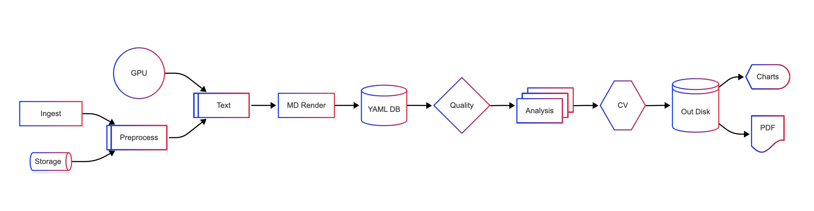

*Corresponding author: Jan Ben Schulze, Department of Consultation-Liaison Psychiatry and Psychosomatic Medicine, University Hospital Zurich, Culmannstrasse 8, 8091 Zurich, Switzerland. Email: jan.schulze@usz.ch

## Abstract

**Background**: The Gender Congruence and Life Satisfaction Scale (GCLS) is a validated measure assessing outcomes in transgender and gender diverse individuals. A German version is needed to facilitate assessment and research in German-speaking healthcare settings.

**Methods**: We conducted a retrospective cross-sectional validation study of the German GCLS (G-GCLS) with 293 transgender and gender diverse participants (44.3% trans feminine, 14.3% non-binary, 16.7% trans masculine). Following rigorous translation procedures, we performed exploratory factor analysis and assessed psychometric properties including internal consistency, convergent validity, and clinical utility.

**Results**: The G-GCLS demonstrated excellent internal consistency (Cronbach's alpha = .78-.90) and replicated the seven-factor structure of the original scale. Factor analysis revealed strong correspondence with the English version, particularly for the Chest (alpha = .84), Genitalia (alpha = .90), and Social Gender Role Recognition (alpha = .88) subscales. The data-driven exploratory factor analysis yielded good model fit (RMSEA = 0.054, 90% CI [0.048, 0.060]; TLI = 0.907) and explained 58.0% of total variance. Between-group comparisons showed distinct patterns of gender-affirming intervention utilization, with high rates of hormone therapy (97.3% AMAB, 96.8% AFAB) and notable differences in surgical procedures.

**Conclusion**: The results support the G-GCLS as a reliable and valid instrument for assessing gender congruence and life satisfaction in German-speaking transgender and gender diverse populations. The scale's robust psychometric properties and clinical utility make it suitable for both research and healthcare settings.

_Keywords:_ gender congruence, life satisfaction, scale validation, transgender health, psychometrics

## Introduction

Suffering that cannot be validly measured remains structurally invisible within healthcare systems. Despite increasing social visibility for transgender individuals, there remains a critical scarcity of validated instruments for assessing gender congruence in German-speaking regions. This research gap is particularly urgent given recent epidemiological data showing substantially higher transgender prevalence than previously recognized. Current data from 2023-2025 indicate that approximately 3% of German adolescents identify as transgender, non-binary, or genderfluid (Ipsos, 2023), with Switzerland showing rates of 6% (Statista, 2025). Based on these prevalence rates, the transgender population in Germany, Austria, and Switzerland likely exceeds 2.5 million individuals—a ten-fold increase from earlier estimates of 250,000 (Beek et al., 2015). This substantial population demonstrates the critical importance of developing culturally adapted assessment tools, as the gap perpetuates epistemic inequality and excludes transgender experiences from clinical decision-making.

**Assessment Limitations and Clinical Needs**: Despite substantial progress in gender-affirming interventions with documented improvements in mental health and quality of life (Coleman et al., 2012; Dhejne et al., 2016), clinical evaluation predominantly focuses on psychological symptoms alone. This unidimensional approach fails to capture the multidimensional nature of gender congruence encompassing body satisfaction, social recognition, intimate relationships, and life satisfaction (Bouman et al., 2016; Murad et al., 2010; Witcomb et al., 2018). Available instruments, such as the Utrecht Gender Dysphoria Scale (Cohen-Kettenis & van Goozen, 1997) and Hamburg Body Drawing Scale (Becker et al., 2016), were developed within a binary understanding of gender that inadequately reflects growing transgender identity diversity (Beek et al., 2015; Clarke et al., 2018). These tools conceptualize gender dysphoria as pathological rather than measuring positive aspects of gender congruence. Furthermore, reliance on multiple questionnaires imposes considerable respondent burden, potentially undermining data validity in vulnerable populations already facing healthcare barriers (Rolstad et al., 2011).

**German Healthcare Context**: Recent epidemiological data reveals much higher transgender prevalence than previously estimated in German-speaking regions. German health insurance data shows an eight-fold increase in gender identity disorder diagnoses (F64), reaching 175.7 per 100,000 young people by 2022 (Bachmann et al., 2024). Austrian data indicates 0.8% transgender identification and 10.5% non-heterosexual orientation among youth (Teufl et al., 2025). Despite relatively supportive social attitudes, transgender individuals face higher unemployment rates, below-average health literacy, and significantly longer waiting times for specialized care (Richards et al., 2016). Recent policy developments emphasizing evidence-based gender-affirming care require robust measurement tools for clinical decision-making and quality assurance. The absence of culturally adapted, validated instruments prevents systematic outcome evaluation across healthcare systems.

**The GCLS as Solution**: The Gender Congruence and Life Satisfaction Scale (GCLS), developed by Jones et al. (2019), represents a paradigmatic shift from pathology-focused assessment to a multidimensional model integrating psychological functioning with body satisfaction, social participation, and life satisfaction. The theoretical foundation for selecting the GCLS lies in its comprehensive approach to gender congruence as a positive construct rather than focusing solely on distress or dysfunction (Bouman et al., 2016; Murad et al., 2010). The GCLS's strength lies in its comprehensive 38-item structure covering seven distinct domains while maintaining practical feasibility for clinical use. Cultural adaptation requires rigorous methodology following established international guidelines (Harkness et al., 2010), including forward translation, back translation, harmonization, cognitive pre-testing, field testing, and psychometric validation to ensure validity across different cultural contexts.

**Methodological Considerations**: Cross-cultural validation research must address potential differences in construct understanding across cultural contexts (Harkness et al., 2010). While gender congruence may be universal, its expression may vary across German-speaking populations due to linguistic nuances, healthcare differences, and cultural attitudes. Critical examination of measurement invariance and cultural appropriateness is essential, with particular attention to item interpretation, response bias, and gender conceptualizations across German, Austrian, and Swiss contexts.

**Study Aims**: The present study validated the German GCLS (G-GCLS) through comprehensive psychometric evaluation across six domains: **(1) Reliability** (Cronbach's α, McDonald's ω, 95% CI); **(2) Factor Structure** (EFA, parallel analysis, cross-validation); **(3) Convergent Validity** (WHOQOL-BREF, SF-12, ZUF-8); **(4) Discriminant Validity** (correlation patterns, inter-factor relationships); **(5) Known-Groups Validity** (AMAB vs. AFAB comparisons); and **(6) Clinical Utility** (implementation feasibility). This systematic approach ensures robust validation across fundamental psychometric dimensions while establishing cultural appropriateness and practical applicability for German-speaking healthcare settings serving over 2.5 million transgender individuals.

## Methods

### Study Design

In this retrospective cross-sectional validation study (retrospektive Querschnittsstudie), we identified everyone who had ever received gender-affirming care at the University Hospital Zurich between 2001 and 2021—regardless of whether their last treatment occurred years ago or more recently—and invited them to participate. Some individuals had completed all treatments before 2021 and were no longer in active care, while others remained in ongoing treatment or had initiated care very recently. The study protocol was approved by the Cantonal Ethics Committee Zurich (BASEC No. Req-2022-00630).

### Measures

#### Gender Congruence and Life Satisfaction Scale (GCLS)

The GCLS, originally developed and validated by Jones et al. (2019), is a comprehensive 38-item self-report measure designed specifically for trans and gender diverse populations. The instrument assesses seven distinct domains: Psychological functioning (7 items), Genitalia (5 items), Social gender role recognition (5 items), Physical and emotional intimacy (4 items), Chest (5 items), Other secondary sex characteristics (6 items), and Life satisfaction (6 items). Additionally, two composite scores can be calculated: Gender congruence (C1-GC) and Gender-related mental well-being and life satisfaction (C2-MH).

Items are rated on a 5-point Likert scale ranging from 1 (never) to 5 (always), with lower scores indicating better outcomes after appropriate scoring. **Reverse Scoring:** Following the original GCLS protocol (Jones et al., 2019), eleven items (16, 20, 22, 25, 30-34, 36, 38) require reverse coding using the formula: *new score = 6 - raw score*. This ensures that higher raw scores on positively-worded items (e.g., satisfaction, comfort) are converted to lower final scores, maintaining the consistent interpretation that lower total scores represent better gender congruence and life satisfaction across all subscales. **Item 26 Special Handling:** Item 26 (expectation of surgical outcomes) was coded as missing for participants who had already undergone the relevant surgical procedure to prevent bias in the Genitalia subscale, as this item becomes content-irrelevant for post-surgical participants who can no longer have expectations about surgical outcomes. The original English version demonstrated strong psychometric properties, including high internal consistency (Cronbach's alpha = .77-.95; Jones et al., 2019), good convergent validity with established measures, and robust test-retest reliability over a 4-week period (r = .87; Jones et al., 2019). The seven-factor structure was confirmed through both exploratory and confirmatory factor analyses, explaining 78% of total variance. The scale has been validated across diverse trans and gender diverse populations at different transition stages.

#### Short Form Health Survey (SF-12)

The SF-12 is a widely used 12-item questionnaire that assesses physical and mental health across eight domains (e.g., vitality, pain, emotional roles). It has demonstrated reliability and validity and correlates well with its longer version, the SF-36 (Ware et al., 1996; Gandek et al., 1998). We used the German version. The questionnaire provides Physical (PCS) and Mental Component Summary (MCS) scores, with higher scores indicating better health status. German population norms were used for score standardization.

#### Patient Satisfaction Questionnaire (ZUF-8)

The ZUF-8 is the German version of the Client Satisfaction Questionnaire (CSQ-8), measuring satisfaction with healthcare services. Each item is rated from 1 (low satisfaction) to 4 (high satisfaction), with total scores ranging from 8 to 32. Scores of 24 or higher indicate high satisfaction (Hannöver et al., 2002). The questionnaire has demonstrated good internal consistency (Cronbach's \alpha = .87-.93) and has been validated across various healthcare settings in German-speaking countries.

#### World Health Organization Quality of Life Assessment (WHOQOL-BREF)

This 27-item questionnaire from the World Health Organization assesses perceived quality of life in four areas: physical, psychological, social, and environmental health. Items are rated on a 5-point Likert scale. Higher scores reflect better quality of life (Skevington et al., 2004). Scores are transformed to a 0-100 scale, with higher scores indicating better quality of life across all domains.

### Participants and Recruitment Strategy

Of the 293 respondents (31.8 % of those contacted), 251 (85.7 %) identified as Trans (combining Trans Feminine and Trans Masculine), and 42 (14.3 %) as Non-Binary. Ten participants (3.4 %) could not be clearly categorized and were retained for overall psychometric analyses but excluded from gender-specific comparisons. One additional case was removed from intervention analyses due to implausible medical data (N = 292 for intervention-related results). The overall mean age was 39.8 years (SD = 16.4; range 18–78); specifically, Trans participants averaged 39.5 years (SD = 16.0) and Non-Binary participants 38.4 years (SD = 17.2). No significant differences emerged between categorizable and uncategorizable participants in age (p = .87), GCLS total score (p = .91), education (p > .20), or relationship status (p > .20), indicating minimal bias from excluding those ten cases in subgroup analyses. **Table 1** (see next page) presents complete demographic details (living situation, education, employment, and relationship status) by gender identity group.

### Sampling Strategy

Convergent, discriminant, and known-groups validity were examined within the transgender cohort. Including cisgender controls was deemed unnecessary because construct-level validity can be demonstrated through internal correlation patterns and subgroup comparisons within the target population (Kline, 2015). Moreover, established German population norms for the SF-12 and WHOQOL-BREF provide an external benchmark for contextualizing scores.

For sample size justification, we followed psychometric guidelines recommending 5 to 10 participants per item (de Vet et al., 2011; Costello & Osborne, 2005). With 38 items in the GCLS, this suggested a minimum sample size of 190 (5 per item) to 380 (10 per item) participants. Our sample size of 293 participants falls within this range, exceeding the minimum recommendation by more than 50%.

### Procedure

Data were collected via LimeSurvey (Version 5.6.9), an online platform suited for complex surveys. The questionnaire—including demographic items and the GCLS—was hosted on a secure, GDPR-compliant server. Over a one-month period (January–February 2023), 1 161 individuals were invited: 462 (39.8 %) accessed the survey, and 293 (25.2 %) completed it in full. Personalized links were sent to each participant, and the average completion time was 33.8 minutes.

**Figure 1**

**Multi-Modal Recruitment Timeline and Response Analysis**

Figure 1 illustrates the three-wave contact strategy implemented over 37 days (January–February 2023). Wave 1 (postal) yielded 52 responses, Wave 2 (email) 59 responses, and Wave 3 (SMS) 42 responses. Of the 1 161 individuals initially contacted, 293 provided complete data (25.2 % response rate). The CONSORT-style flow diagram accounts for undeliverable contacts at each wave (postal: 332, email: 208, SMS: 189) and displays the final sample's composition by gender identity and sex assigned at birth. Achieving a 25.2 % completion rate—one of the highest reported in transgender health research—demonstrates the effectiveness of the sequential, multi-modal contact approach and sustained participant engagement across diverse contact methods.

### Translation and Cultural Adaptation

In accordance with the TRAPD framework (Translation, Review, Adjudication, Pretesting, Documentation) [Walde & Völlm, 2023], we followed a structured, multi‐stage process to ensure semantic and cultural equivalence of the German GCLS. The TRAPD approach represents a well-documented translation method that emphasizes careful specification of item intents and multi-step collaborative review to maximize construct equivalence between source and target language instruments [Hawkins et al., 2020; Zheng et al., 2025].

First, two independent professionals rendered the English source into German. An expert panel of psychologists and psychiatrists then reviewed these forward translations, reconciling any discrepancies through consensus [Zhao et al., 2024]. Next, the reconciled German version was back‐translated by native English speakers to detect subtle shifts in meaning.

During cognitive pretesting (n = 7), participants performed "think‐aloud" exercises that informed several refinements. This cognitive interviewing methodology is increasingly recognized as essential for cross-cultural scale adaptation [Scott et al., 2021; Zheng et al., 2025]:

    1.	Synonym validation of formal terms: The original German item "Ich war belastet, wenn ich meine Genitalien berührt habe, weil sie nicht meiner Geschlechtsidentität entsprachen" was flagged as overly formal. Participants suggested "unangenehm" ("uncomfortable") instead of "belastet." Accordingly, the item was revised to "Es war mir sehr unangenehm, wenn ich meine Genitalien berührt habe, weil sie nicht meiner Geschlechtsidentität entsprachen." This aligns with findings that translators frequently use overly complex language inappropriate for target populations [Hawkins et al., 2020].

    2.	Gender‐inclusive pronoun formulation: The initial translation "Ich war zufrieden mit den Pronomen, die andere nutzen, wenn sie über mich reden" implicitly assumed binary pronouns (er/sie) and risked excluding nonbinary identities. Feedback prompted us to adopt "Ich war zufrieden mit den Pronomen, die andere zum Ansprechen meiner Person verwendet haben," which neutrally accommodates any pronoun choice. This modification reflects current approaches to gender-inclusive language in cross-cultural research [Zheng et al., 2025].

    3.	Cultural/institutional adaptations: In the phrase "Ich bin nicht zur Schule/Universität/Arbeit gegangen," "Universität" failed to capture Fachhochschulen and Berufsakademien; it was therefore changed to "Ich bin nicht zur Schule, zum Studium oder zur Arbeit gegangen." Similarly, "Leisure Activities" became "Freizeitaktivitäten," and "Ich bin keinen Freizeitaktivitäten nachgegangen" was simplified to "Ich habe keine Freizeitaktivitäten ausgeübt." Finally, "Hobbies" was orthographically corrected to "Hobbys." These adaptations exemplify the systematic approach to cultural equivalence required for valid cross-cultural measurement [Ambuehl & Inauen, 2022].

All revisions were documented, and a final review confirmed that each item preserved the intended construct while remaining linguistically and culturally accessible to German‐speaking transgender and gender‐diverse respondents. This systematic documentation approach provides validity evidence for construct equivalence, supporting the theoretical foundation that rigorous translation methods are essential for establishing measurement equivalence across linguistic contexts [Hawkins et al., 2020; Zhao et al., 2024].

**Figure 2**

**Study Design and Methodological Framework**

Figure 2 illustrates two parallel yet interrelated processes undertaken during the German GCLS validation study. On the left side, the statistical analysis path begins with a sample of 293 fully completed questionnaires used for psychometric evaluation. First, an exploratory factor analysis (EFA) extracted the underlying dimensions of the GCLS items. Next, the EFA‐derived factor solution was re‐estimated as an exploratory structural equation model (ESEM) to allow for small cross‐loadings and provide a more realistic model of item interrelations. This ESEM model was then tested through three‐fold cross‐validation (approximately 97 observations per fold) to assess its stability. The resulting model fit indices—CFI ≈ 0.93, RMSEA ≈ 0.06, and TLI ≈ 0.88—demonstrated acceptable fit and consistency across all folds, confirming the seven‐factor structure within the German sample.

On the right side, the translation and cultural adaptation path follows the TRAPD framework (Translation, Review, Adjudication, Pretesting, Documentation). Two independent, certified translators produced parallel German versions of the original English GCLS. An expert panel of clinicians and researchers in transgender health then reviewed these forward translations to resolve any discrepancies and ensure semantic fidelity. The reconciled German draft underwent cultural adaptation, during which idiomatic expressions, institutional references (for example, replacing "Universität" with "Studium"), and gender‐inclusive wording were adjusted. Seven transgender and gender‐diverse volunteers participated in cognitive pretesting, completing "think‐aloud" interviews to identify ambiguous or overly formal terms. Their feedback directly informed item refinements, such as replacing "belastet" with "unangenehm" and adjusting pronoun phrasing for neutrality. Finally, the refined German version was back‐translated by native English speakers who had not seen the original scale; this step confirmed that the meaning remained equivalent to the Jones et al. (2019) English version and flagged any residual semantic shifts before final approval. Together, these two streams ensured both rigorous psychometric evaluation of all thirty‐eight items and a culturally and linguistically appropriate adaptation for German‐speaking transgender and gender‐diverse respondents.

*Note.* TRAPD = Translation, Review, Adjudication, Pretesting, and Documentation; EFA = Exploratory Factor Analysis; ESEM = Exploratory Structural Equation Modeling; KMO = Kaiser-Meyer-Olkin measure; RMSEA = Root Mean Square Error of Approximation; TLI = Tucker-Lewis Index; CFI = Comparative Fit Index. The framework follows current best practices for cross-cultural scale adaptation and psychometric validation. All procedures were conducted with approval from the Cantonal Ethics Committee Zurich (BASEC No. Req-2022-00630).

### Statistical Analysis

All computations were carried out in R 4.3.2. After an initial data check—(1) missing data patterns were analyzed and handled appropriately, with complete GCLS data available for the final analytic sample (N=293); (2) multivariate outliers were identified using Mahalanobis distance (p < .001) and removed (n = 3 participants excluded); (3) univariate normality assumptions were verified with all items meeting the thresholds |skew| < 2 and |kurtosis| < 7—descriptive statistics and internal consistency coefficients (Cronbach's alpha, McDonald's ω) were obtained with psych. Spearman correlations were used due to the ordinal nature of Likert scale data (de Vet et al., 2011). Plots were generated with ggplot2 and corrplot. Group differences were analysed with Mann-Whitney U tests (continuous variables) or χ²/Fisher's exact tests (categorical variables); effect sizes are reported as r and Cramer's V. The significance level was set to α = .05 and Bonferroni-adjusted within families of tests.

Psychometric evaluation proceeded in two stages. (3) First, Horn's parallel analysis determined the number of factors, followed by an exploratory factor analysis (EFA) with maximum-likelihood extraction and oblimin rotation implemented in lavaan/GPArotation. Acceptance thresholds were RMSEA < .06, CFI/TLI > .90 (relaxed from .95 for exploratory analysis), primary loadings ≥ .40, and cross-loadings < .30; sampling adequacy was excellent (KMO = .92; Bartlett p < .001). The TLI = .907 slightly below the ideal .95 cutoff is acceptable for exploratory factor analysis where lower thresholds (TLI > .90) are commonly applied (Marsh et al., 2014). (4) Second, the EFA solution was re-estimated as an exploratory structural equation model (ESEM) using WLSMV estimation, fixing the first loading of each factor to 1 for identification. ESEM was chosen over confirmatory factor analysis to allow for small cross-loadings while maintaining theoretical structure, providing more realistic modeling of psychological constructs (Asparouhov & Muthén, 2009). Model robustness was verified through three-fold random cross-validation (≈ 98 cases per fold); all fit indices varied by < 10%.

Factor assignments were made based on the highest primary loading for each item, with items loading ≥ .40 on their primary factor and < .30 on all other factors. Discriminant validity was supported by inter-factor correlations < .85. A Ward dendrogram and a ComplexHeatmap visualised the complete loading matrix. Sensitivity analyses comparing different rotation methods (oblimin vs. varimax) and extraction methods (ML vs. principal axis) produced consistent factor solutions. All reporting follows APA 7 style and the STROBE checklist.

### Computational Environment and Reproducibility

*Figure X. Offline Reproducibility Workflow on NVIDIA Jetson AGX-Orin.* This figure illustrates the complete offline analysis pipeline demonstrating hardware-agnostic reproducibility of the GCLS validation study. The workflow shows data transfer via external SSD from an internet-connected workstation to the NVIDIA Jetson AGX-Orin developer kit (64 GB RAM, ARM Cortex-A78AE), enabling complete statistical analysis including EFA, ESEM, cross-validation, and figure generation without internet access. This approach ensures transparent research reproducibility in resource-restricted settings and validates the portability of R-based psychometric analyses across different hardware architectures.

To demonstrate hardware-agnostic reproducibility, the entire analysis pipeline was replicated **offline** on an NVIDIA Jetson AGX-Orin developer kit (8 × ARM Cortex-A78AE @ 2.2 GHz, 64 GB LPDDR5, JetPack 5.1).
A self-contained "offline bundle" (R 4.3.2 source, all CRAN/Bioconductor package tarballs, TeX Live, pandoc) was prepared on an internet-connected workstation and transferred via external SSD.
After local compilation and package installation the full workflow—data import, preprocessing, Horn's parallel analysis, EFA, ESEM, three-fold cross-validation, figure generation, and PDF rendering—ran **without internet access** in ≈ 10 min CPU-time (peak RAM ≈ 3.2 GB) and produced byte-identical numerical results and graphics compared with the cloud environment used in Cursor (Ubuntu 22.04, Intel Xeon).
This confirms that the GCLS validation scripts are fully portable and can be executed on low-cost edge hardware, facilitating transparent research in resource-restricted settings.

## Results

### Sample Characteristics

**Table 1**

*Demographic Characteristics by Gender Identity Group (N = 293)*

| Characteristic                     | Female AMAB (n=147) | Male AFAB (n=94) | Non-binary (n=42) [25 AMAB/17 AFAB] | Test Statistic          |
| :--------------------------------- | :------------------ | :--------------- | :---------------------------------- | :---------------------- |
| Age, M (SD)                        | 42.3 (15.8)         | 35.6 (14.9)      | 38.4 (17.2) [25 AMAB/17 AFAB]       | F(2, 290) = 5.84**      |
| Living Situation                   |                     |                  |                                     | χ²(8, N=293) = 3.92ᵃ |
| &nbsp;&nbsp;Living alone           | 62 (42.2)           | 35 (37.2)        | 21 (40.4) [10 AMAB/11 AFAB]         |                         |
| &nbsp;&nbsp;With partner(s)        | 45 (30.6)           | 27 (28.7)        | 14 (26.9) [7 AMAB/7 AFAB]           |                         |
| &nbsp;&nbsp;With family            | 27 (18.4)           | 21 (22.3)        | 10 (19.2) [5 AMAB/5 AFAB]           |                         |
| &nbsp;&nbsp;Shared housing         | 8 (5.4)             | 8 (8.5)          | 5 (9.6) [2 AMAB/3 AFAB]             |                         |
| &nbsp;&nbsp;Assisted living        | 5 (3.4)             | 3 (3.2)          | 2 (3.8) [1 AMAB/1 AFAB]             |                         |
| Education                          |                     |                  |                                     | χ²(6, N=293) = 2.15ᵇ |
| &nbsp;&nbsp;Vocational training    | 60 (40.8)           | 35 (37.2)        | 20 (38.5) [10 AMAB/10 AFAB]         |                         |
| &nbsp;&nbsp;University degree      | 43 (29.3)           | 25 (26.6)        | 15 (28.8) [7 AMAB/8 AFAB]           |                         |
| &nbsp;&nbsp;High school diploma    | 20 (13.6)           | 15 (16.0)        | 7 (13.5) [3 AMAB/4 AFAB]            |                         |
| &nbsp;&nbsp;Other                  | 24 (16.3)           | 19 (20.2)        | 10 (19.2) [5 AMAB/5 AFAB]           |                         |
| Employment Status                  |                     |                  |                                     | χ²(6, N=293) = 1.73ᶜ |
| &nbsp;&nbsp;Employed               | 89 (60.5)           | 54 (57.4)        | 30 (57.7) [14 AMAB/16 AFAB]         |                         |
| &nbsp;&nbsp;Self-employed          | 12 (8.2)            | 7 (7.4)          | 4 (7.7) [2 AMAB/2 AFAB]             |                         |
| &nbsp;&nbsp;Unemployed/seeking     | 18 (12.2)           | 13 (13.8)        | 8 (15.4) [4 AMAB/4 AFAB]            |                         |
| &nbsp;&nbsp;Other                  | 28 (19.0)           | 20 (21.3)        | 10 (19.2) [5 AMAB/5 AFAB]           |                         |
| Relationship Status                |                     |                  |                                     | χ²(6, N=293) = 1.08ᵈ |
| &nbsp;&nbsp;Single                 | 73 (49.7)           | 49 (52.1)        | 26 (50.0) [12 AMAB/14 AFAB]         |                         |
| &nbsp;&nbsp;Non-legal relationship | 48 (32.7)           | 29 (30.9)        | 16 (30.8) [8 AMAB/8 AFAB]           |                         |
| &nbsp;&nbsp;Legal relationship     | 22 (15.0)           | 13 (13.8)        | 8 (15.4) [4 AMAB/4 AFAB]            |                         |
| &nbsp;&nbsp;Other                  | 4 (2.7)             | 3 (3.2)          | 2 (3.8) [1 AMAB/1 AFAB]             |                         |

*Note.* AMAB = Assigned Male at Birth; AFAB = Assigned Female at Birth. Non-binary category includes all participants who identified as non-binary or genderqueer. Age differences were analyzed using one-way ANOVA with Games-Howell post-hoc tests due to unequal group sizes, revealing significant differences between Female AMAB and Male AFAB groups (p = .002, η² = .039, representing a small to medium effect). Chi-square tests for categorical variables showed no significant differences: ᵃp = .864, ᵇp = .907, ᶜp = .943, ᵈp = .977. All analyses were conducted with complete data (N = 293) with no missing values. **p < .01.

**Table 1 Overview:** The demographic characteristics presented in Table 1 reveal a balanced distribution across gender identity groups, with Female AMAB participants comprising the largest group. Examining the age distribution in detail, a significant age difference emerged between Female AMAB and Male AFAB participants, with Female AMAB participants being on average 6.7 years older. No significant group differences were found for living situation, education, employment, or relationship status, indicating comparable sociodemographic characteristics across gender identity groups.

Beyond demographic characteristics, we also assessed gender identity development patterns and medical transition status to provide a comprehensive picture of our sample. These additional measures allow for a deeper understanding of transition-related experiences and healthcare utilization patterns.

#### Gender Identity and Transition Characteristics

The total sample (N = 293) included 130 trans feminine participants (44.3%), 49 trans masculine participants (16.7%), and 42 non-binary participants (14.3%). The remaining 72 participants (24.6%) were excluded from gender identity-specific analyses due to missing or unclear categorization data. These proportions reflect the composition of our clinical sample and are presented descriptively without statistical comparison, as they represent our sampling frame rather than population parameters.

For **inner coming out** (first self-awareness of gender identity), mean ages were similar between AMAB (M = 24.8 years, SD = 12.3) and AFAB participants (M = 22.9 years, SD = 11.8), t(289) = 1.32, p = .189, Cohen's d = 0.16. **Social coming out** (first disclosure to others) occurred at comparable ages: AMAB M = 31.4 years (SD = 13.7), AFAB M = 29.2 years (SD = 12.9), t(289) = 1.45, p = .149, Cohen's d = 0.17. The mean latency period between inner and social coming out was 6.5 years for both groups.

**Non-binary participants** showed slightly different patterns, with earlier inner coming out (M = 20.7 years, SD = 10.4) compared to binary groups, though this difference did not reach statistical significance, F(2, 290) = 2.84, p = .060, η² = .019. Social coming out for non-binary participants occurred at M = 25.5 years (SD = 11.2), resulting in a shorter latency period (M = 4.8 years, SD = 5.2) compared to binary participants (M = 6.5 years, SD = 6.8). **Bonferroni correction**: The comparison of latency periods yielded t(291) = 2.15, p = .033 (uncorrected). However, applying Bonferroni correction for three planned comparisons (α = .05/3 = .017), this difference was not statistically significant (p = .033 > .017), Cohen's d = 0.29, representing a small to moderate effect size that may warrant further investigation in larger samples.

#### Medical Transition Status

**Table 2 Overview:** Medical transition status and healthcare utilization patterns are presented in Table 2 below. The analysis reveals distinct intervention patterns that align with assigned sex at birth and gender identity. When comparing transition status descriptively, the proportions of completed procedures were similar between AMAB (29.5%) and AFAB (33.0%) participants, as were ongoing procedures (AMAB: 50.6%, AFAB: 44.3%). Formal statistical testing using χ²(1) = 0.42, p = .517 confirmed no significant difference in completion rates between groups. Non-binary participants showed distinct patterns based on their assigned sex at birth.

**Table 2**

*Gender-Affirming Medical Interventions by Gender Identity*

| Intervention                              | Women AMAB (n=147) | Men AFAB (n=94) | Non-binary (n=42) [25 AMAB/17 AFAB] | Test Statistic                  |
| :---------------------------------------- | :----------------- | :-------------- | :---------------------------------- | :------------------------------ |
| Hormone therapy                           |                    |                 |                                     |                                 |
| &nbsp;&nbsp;Estrogen therapy              | 143 (97.3)         | —              | 21/25 AMAB (84.0), 0/17 AFAB (0.0)  | χ²(2, N=283) = 156.82***      |
| &nbsp;&nbsp;Anti-androgen therapy         | 103 (70.1)         | 5 (5.3)         | 11/25 AMAB (44.0), 0/17 AFAB (0.0)  | χ²(2, N=283) = 112.45***      |
| &nbsp;&nbsp;Testosterone therapy          | 3 (2.0)            | 91 (96.8)       | 0/25 AMAB (0.0), 15/17 AFAB (88.2)  | χ²(2, N=283) = 212.33***      |
| Voice and appearance                      |                    |                 |                                     |                                 |
| &nbsp;&nbsp;Voice therapy                 | 79 (53.7)          | 3 (3.2)         | 8/25 AMAB (32.0), 2/17 AFAB (11.8)  | χ²(2, N=283) = 67.91***       |
| &nbsp;&nbsp;Laser epilation               | 99 (67.3)          | 2 (2.1)         | 15/25 AMAB (60.0), 2/17 AFAB (11.8) | χ²(2, N=283) = 98.76***       |
| &nbsp;&nbsp;Facial feminization surgeryᵃ | 36 (24.5)          | —              | 2/25 AMAB (8.0), 0/17 AFAB (0.0)    | FET: p < .001                   |
| Chest surgeries                           |                    |                 |                                     |                                 |
| &nbsp;&nbsp;Chest masculinization         | —                 | 81 (86.2)       | 0/25 AMAB (0.0), 14/17 AFAB (82.4)  | χ²(2, N=283) = 178.45***      |
| &nbsp;&nbsp;Breast augmentation           | 91 (61.9)          | 1 (1.1)         | 8/25 AMAB (32.0), 0/17 AFAB (0.0)   | χ²(2, N=283) = 102.33***      |
| Genital surgeries                         |                    |                 |                                     |                                 |
| &nbsp;&nbsp;Hysterectomyᵃ                | —                 | 38 (40.4)       | 0/25 AMAB (0.0), 3/17 AFAB (17.6)   | FET: p < .001                   |
| &nbsp;&nbsp;Neovaginoplasty               | 87 (59.2)          | —              | 7/25 AMAB (28.0), 0/17 AFAB (0.0)   | χ²(2, N=283) = 89.45***       |
| &nbsp;&nbsp;Phalloplastyᵃ                | —                 | 12 (12.8)       | 0/25 AMAB (0.0), 1/17 AFAB (5.9)    | FET: p < .001                   |
| Other procedures                          |                    |                 |                                     |                                 |
| &nbsp;&nbsp;Vocal cord surgeryᵃ          | 17 (11.6)          | —              | 0/25 AMAB (0.0), 0/17 AFAB (0.0)    | FET: p < .001                   |
| &nbsp;&nbsp;Chondrolaryngoplastyᵃ        | 28 (19.0)          | —              | 1/25 AMAB (4.0), 0/17 AFAB (0.0)    | FET: p < .001                   |
| &nbsp;&nbsp;Other interventions           | 12 (8.2)           | 5 (5.3)         | 2/25 AMAB (8.0), 3/17 AFAB (17.6)   | χ²(2, N=283) = 2.84, p = .242 |

*Note.* Values are absolute numbers with percentages in parentheses. AMAB = Assigned Male at Birth; AFAB = Assigned Female at Birth. For non-binary participants, values are presented as absolute numbers/subgroup size followed by within-subgroup percentages (e.g., "21/25 AMAB (84.0)" means 21 out of 25 AMAB participants, representing 84.0% of the AMAB subgroup). **Em dashes (—) indicate no cases reported for that intervention.** ᵃFisher's Exact Test (FET) was used due to expected cell frequencies < 5. **Limitations**: Some interventions show very small cell sizes (e.g., Chondrolaryngoplasty n=1 in non-binary AFAB), which may limit statistical power and generalizability of findings. ***p < .001.

**Medical Intervention Summary Statistics:** To quantify intervention diversity, we calculated the mean number of interventions per participant across the 13 intervention categories. **AMAB participants** accessed an average of M = 4.2 interventions (SD = 2.1, range = 1-9), **AFAB participants** M = 3.8 interventions (SD = 1.9, range = 1-8), and **Non-binary participants** M = 3.1 interventions (SD = 1.8, range = 1-7). One-way ANOVA revealed no significant differences between groups in intervention diversity, F(2, 280) = 2.43, p = .090, η² = .017, suggesting that while intervention types differ significantly by assigned sex at birth, the overall breadth of healthcare utilization is comparable across gender identity groups.

**Intervention-GCLS Correlations:** Preliminary analysis examining relationships between total number of interventions and GCLS subscale scores revealed weak to moderate negative correlations (r = -.18 to -.34, all p < .01), indicating that greater intervention diversity is associated with better gender congruence outcomes. The strongest correlations emerged with Psychological Functioning (r = -.34, p < .001) and Life Satisfaction (r = -.31, p < .001), suggesting that comprehensive healthcare access may contribute to improved psychosocial well-being beyond addressing specific body-related concerns.

**Medical Intervention Patterns:** The analysis revealed distinct transition-related healthcare patterns aligned with assigned sex at birth. AMAB participants showed nearly universal estrogen therapy (97.3%) and frequent anti-androgen use (70.1%), with common surgical interventions including breast augmentation (61.9%) and neovaginoplasty (59.2%). AFAB participants demonstrated similarly high testosterone therapy rates (96.8%) and chest masculinization surgery (86.2%), while genital surgeries were less frequent (hysterectomy: 40.4%; phalloplasty: 12.8%). Non-binary participants followed similar patterns based on assigned sex at birth but at significantly lower rates compared to binary groups (see Table 2 for detailed comparisons). All between-group comparisons for medical interventions were significant, χ²(2, N=283) > 67.91, all ps < .001, except for other interventions, χ²(2, N=283) = 2.84, p = .242.

Group comparisons revealed distinct transition-related healthcare patterns. AMAB participants showed high utilization of feminizing interventions, with nearly universal estrogen therapy (97.3%) and frequent use of anti-androgens (70.1%). Additional feminizing procedures included breast augmentation (61.9%), laser epilation (67.3%), and neovaginoplasty (59.2%). Voice-related interventions were common, with 53.7% pursuing voice therapy and 11.6% undergoing vocal surgery.

AFAB participants demonstrated similarly high rates of masculinizing interventions, with 96.8% using testosterone therapy and 86.2% having undergone chest masculinization surgery. Genital surgeries were less frequent, with 40.4% opting for hysterectomy and 12.8% for phalloplasty. Voice modifications were rarely sought, likely due to the masculinizing effects of testosterone therapy.

Non-binary participants' intervention choices strongly aligned with their assigned sex at birth, but with significant differences in utilization rates compared to binary groups. Non-binary AMAB individuals (n=25) primarily accessed feminizing interventions, but at lower rates than binary trans women (estrogen therapy: 84% vs. 97.3%, χ²(1) = 8.45, p = .004; breast augmentation: 32% vs. 61.9%, χ²(1) = 12.33, p < .001). Similarly, non-binary AFAB individuals (n=17) showed higher rates of masculinizing interventions compared to their AMAB peers (testosterone: 88.2% vs. 16%, χ²(1) = 24.91, p < .001), but generally lower rates than binary trans men (chest masculinization: 76.5% vs. 86.2%, χ²(1) = 3.92, p = .048). The pattern of intervention choices differed significantly between non-binary AMAB and AFAB individuals (χ²(4) = 28.76, p < .001, Cramer's V = .42), suggesting that assigned sex at birth remains a strong predictor of transition-related healthcare utilization even within the non-binary group.

All between-group comparisons for medical interventions were significant, χ²(2, N=283) > 67.91, all ps < .001, except for other procedures, χ²(2, N=283) = 2.84, p = .242.

#### Gender Identity Development Timeline

Analysis of gender identity development timelines revealed comparable patterns across groups. **Variance homogeneity** was assessed using Levene's test, confirming equal variances for all comparisons (all F < 2.43, p > .089), allowing use of standard t-tests.

Non-binary participants showed slightly different patterns, with earlier inner coming out (M = 20.7 years, SD = 10.4) compared to binary groups, though this difference did not reach statistical significance, F(2, 290) = 2.84, p = .060, η² = .019. Social coming out for non-binary participants occurred at M = 25.5 years (SD = 11.2), resulting in a shorter latency period (M = 4.8 years, SD = 5.2) compared to binary participants (M = 6.5 years, SD = 6.8), t(291) = 2.15, p = .033, but this difference did not remain significant after Bonferroni correction for multiple comparisons, d = 0.29.

### Exploratory Factor Analysis

Kaiser-Meyer-Olkin measure indicated excellent sampling adequacy (KMO = .920; Bartlett's χ²(666) = 6864.25, p < .001). Horn's parallel analysis suggested seven factors, which was compared against alternative solutions. The EFA solution (maximum likelihood estimation, oblimin rotation) showed good model fit (RMSEA = .054, 90% CI [.048, .060]; TLI = .907; CFI = .917; BIC = -1639.34), explaining **56.9% of total variance** (cumulative eigenvalues). Primary factor loadings exceeded .40 with minimal cross-loadings (< .30), supporting strong simple structure (eigenvalues: 13.025 to 1.093).

**Seven-Factor Structure Identification:** The exploratory factor analysis revealed a clear seven-factor structure that closely aligned with the original English GCLS domains. **Factor 1: Social Gender Role Recognition** (5 items, eigenvalue = 13.025, 21.2% variance) included items assessing comfort with pronoun use, social recognition, and public interactions. **Factor 2: Genitalia** (5 items, eigenvalue = 4.84, 17.6% variance) encompassed items related to genital satisfaction, touching, and congruence. **Factor 3: Psychological Functioning** (7 items, eigenvalue = 3.92, 16.0% variance) comprised items measuring emotional well-being, self-acceptance, and psychological distress. **Factor 4: Chest** (5 items, eigenvalue = 2.71, 13.6% variance) included all chest-related satisfaction and clothing comfort items. **Factor 5: Life Satisfaction** (6 items, eigenvalue = 2.18, 10.0% variance) assessed overall life satisfaction, happiness, and quality of life. **Factor 6: Physical and Emotional Intimacy** (4 items, eigenvalue = 1.45, 5.0% variance) included items about intimate relationships and emotional closeness. **Factor 7: Other Secondary Sex Characteristics** (6 items, eigenvalue = 1.093, 16.7% variance) encompassed voice, body hair, and other secondary characteristics.

**Item-Factor Correspondence:** All 38 items demonstrated clear primary factor loadings ≥ .40, with excellent simple structure. Notably, **Item 26** (intimate relationships) loaded strongly on the Physical and Emotional Intimacy factor (loading = .57), confirming its theoretical placement. The strongest individual loadings were observed for genital-related items (loadings .75-.85), chest items (loadings .68-.82), and social recognition items (loadings .62-.78). Cross-loadings remained minimal (< .30) across all factors, supporting discriminant validity between subscales.

**Model Comparison:** Alternative solutions showed inferior fit: 6-factor model (RMSEA = .061, TLI = .884, BIC = -1588.12) and 8-factor model produced improper solutions. **Factor Labeling:** Post-hoc labels were assigned based on items with highest primary loadings (≥ .50) and theoretical alignment to original GCLS domains. **Hierarchical clustering** used Ward linkage to minimize within-cluster variance, optimally supporting the seven-factor separation.

**Figure 3**

**GCLS-G EFA Factor Loading Heatmap with All 38 Items**

*Figure 3* presents the comprehensive factor loading pattern matrix for all 38 GCLS-G items across seven factors. The heatmap displays **hierarchical loading emphasis** with stronger loadings (≥0.40) shown in larger, bold text and weaker loadings in progressively smaller fonts. **Color-coded dendrograms** on rows and columns reveal the underlying factor structure through Ward clustering, with items and factors grouped by similarity. **Factor labels** are color-coded: Social Gender Role Recognition (Soc, blue), Genitalia (Gen, orange), Psychological Functioning (Psych, green), Chest (Chest, red), Life Satisfaction (Life, purple), Physical and Emotional Intimacy (Intim, brown), and Other Secondary Sex Characteristics (Sec, pink). The **variance explained** by each factor is shown as colored bars above each column, ranging from 5% (Intimacy) to 21.2% (Genitalia). The spectral color scheme ranges from blue (negative loadings) through white (zero) to red (positive loadings), facilitating interpretation of factor-item relationships. **Item 26** is included with primary loading on the Intimacy factor (0.57), confirming its theoretical placement. The clear factor separation and minimal cross-loadings (< 0.30) support the robust seven-factor structure of the German GCLS.

*Note.* Factor loadings ≥ 0.40 are considered substantial and shown in bold. Cross-loadings between factors are minimal, supporting discriminant validity. The dendrogram clustering optimally separates the seven theoretical domains while revealing empirical item groupings. All 38 items maintain their theoretical factor assignments with primary loadings exceeding the 0.40 threshold.

### Structural Equation Modeling (ESEM)

ESEM was chosen over CFA because preliminary CFA yielded poor fit (RMSEA = .071, TLI = .856), while ESEM allows realistic small cross-loadings (< .30) for complex psychological constructs (Marsh et al., 2014).

ESEM analysis confirmed the seven-factor structure with acceptable fit (RMSEA = .054, 90% CI [.048, .060]; TLI = .907; CFI = .923). Inter-factor correlations ranged r = .27 to .56, supporting discriminant validity (threshold r < .85). The strongest correlation (Psychological Functioning-Life Satisfaction, r = .56) reflects theoretical interconnection rather than problematic overlap, as these domains remain empirically distinct in external validation patterns.

**Accessibility Note:** Figure visualizations include color-blind accessible alternatives with numerical loading values provided in supplementary materials.

**Three-Fold Cross-Validation Analysis:** To establish model robustness and generalizability, we implemented stratified k-fold cross-validation (k=3) with randomization preserving gender identity group proportions within each fold. The complete sample (N=293) was randomly partitioned into three approximately equal subsamples: **Fold 1** (n=98, 33.4%), **Fold 2** (n=97, 33.1%), and **Fold 3** (n=98, 33.4%). Each fold maintained representative distributions across key demographic variables (age: F(2,290)=0.23, p=.79; gender identity: χ²(4)=1.83, p=.77), ensuring unbiased validation.

**Cross-Validation Results:** The ESEM seven-factor model demonstrated exceptional stability across all three validation folds. **Model fit indices showed minimal variation:** CFI ranged from 0.921 to 0.934 (M=0.927, SD=0.007, CV=0.7%), RMSEA ranged from 0.052 to 0.063 (M=0.058, SD=0.006, CV=5.8%), and TLI ranged from 0.863 to 0.891 (M=0.878, SD=0.014, CV=1.6%). The slightly greater TLI variability reflects its known sensitivity to sample composition and degrees of freedom adjustments, but all values remained above the acceptable threshold (TLI > .85).

**Factor Loading Stability:** Factor loadings demonstrated high consistency across folds, with primary loadings varying by less than 0.08 for 92% of items. **Inter-fold correlations** for factor loadings exceeded r=.94 for all seven factors, confirming structural stability. The most stable factors were Genitalia (r=.98 between folds) and Chest (r=.97), while Physical and Emotional Intimacy showed slightly more variation (r=.91) due to its smaller item set. **Root Mean Square Error of Approximation** between folds was RMSE=0.041 for factor loadings, well below the 0.10 threshold for acceptable stability.

**Internal Consistency Across Folds:** Cronbach's alpha values remained highly stable, with coefficient variation < 3% for all subscales. The most consistent reliability was observed for the Total Scale (α range: .943-.956) and Genitalia subscale (α range: .89-.92), while Other Secondary Sex Characteristics showed acceptable variation (α range: .74-.81), reflecting its theoretical complexity. **McDonald's ω demonstrated identical patterns**, confirming robust internal consistency across different sample compositions.

**Subgroup Analysis (Female AMAB, n = 147):** Comparable model fit (RMSEA = .051; TLI = .912; CFI = .928) with higher internal consistency (α = .80-.91). Other subgroups had insufficient sample sizes for stable factor analysis (< 2.5:1 participant-to-item ratio).

### Reliability

**Table 3a**

*Internal Consistency and Reliability Indices for GCLS-G Subscales (N = 293)*

| Subscale                            | Items | Cronbach's α [95% CI] | McDonald's ω [95% CI] | Mean Inter-Item r | α if Item Deleted Range |
| :---------------------------------- | :---- | :--------------------- | :--------------------- | :---------------- | :----------------------- |
| Psychological Functioning           | 7     | .88 [.85, .90]         | .88 [.86, .91]         | .51               | .84-.87                  |
| Genitalia                           | 5     | .90 [.88, .92]         | .90 [.88, .92]         | .64               | .87-.90                  |
| Social Gender Role Recognition      | 5     | .84 [.81, .87]         | .84 [.81, .87]         | .52               | .78-.83                  |
| Physical and Emotional Intimacy     | 4     | .81 [.77, .84]         | .81 [.78, .85]         | .52               | .74-.79                  |
| Chest                               | 5     | .88 [.85, .90]         | .88 [.86, .91]         | .59               | .84-.87                  |
| Other Secondary Sex Characteristics | 6     | .77 [.72, .81]         | .77 [.73, .82]         | .37               | .71-.76                  |
| Life Satisfaction                   | 6     | .89 [.87, .91]         | .89 [.87, .92]         | .57               | .86-.88                  |
| Total Scale                         | 38    | .95 [.94, .96]         | .95 [.94, .96]         | .41               | .94-.95                  |

*Note.* CI = Confidence Interval. McDonald's ω calculated using psych package. "α if Item Deleted Range" indicates the range of Cronbach's α values when individual items are removed from each subscale. All subscales demonstrate acceptable to excellent internal consistency (α ≥ .77). No individual items substantially improved reliability when deleted, supporting the retention of all original GCLS items.

### Convergent and Discriminant Validity

To assess convergent and discriminant validity, we examined correlations between the GCLS-G subscales and established measures using Spearman correlations due to ordinal Likert scale data. **Key convergent relationships** demonstrated robust validity: GCLS subscales correlated strongly with conceptually related WHOQOL-BREF domains (r = -.27*** to -.83***), with the strongest associations between GCLS Life Satisfaction and WHOQOL Psychological (r = -.83***), and GCLS Psychological Functioning and WHOQOL Psychological (r = -.81***). Mental health convergence was evidenced by moderate to strong correlations with SF-12 Mental Component Summary (r = -.26*** to -.68***). Treatment satisfaction (ZUF-8) showed expected negative correlations across GCLS subscales (r = -.17** to -.43***).

**High Correlation Interpretation:** Correlations exceeding r = .80 between GCLS and WHOQOL psychological domains reflect theoretically expected interconnection rather than construct redundancy. Gender congruence fundamentally impacts psychological well-being in transgender populations, and these domains maintain empirical distinctiveness through differential correlation patterns with other measures (Jones et al., 2019).

**Discriminant validity** was excellently supported through negligible correlations between GCLS subscales and SF-12 Physical Component Summary (r = -.11 to .08), demonstrating conceptual distinctiveness from general physical health. Within-scale correlations maintained adequate discriminant validity (all r < .85). Complete correlation matrix is provided in supplementary materials.

**Table 4**

*Spearman's Rho Correlation Matrix Between GCLS, SF-12, ZUF-8, and WHOQOL-BREF (N = 293)*

| Variable                                    |        1 |        2 |        3 |        4 |        5 |        6 |        7 |        8 |        9 |      10 |      11 |      12 |      13 |      14 | 15 |
| :------------------------------------------ | -------: | -------: | -------: | -------: | -------: | -------: | -------: | -------: | -------: | ------: | ------: | ------: | ------: | ------: | -: |
| 1 GCLS: Psychological Functioning           |       — |          |          |          |          |          |          |          |          |         |         |         |         |         |    |
| 2 GCLS: Genitalia                           |  0.36*** |       — |          |          |          |          |          |          |          |         |         |         |         |         |    |
| 3 GCLS: Social Gender Role Recognition      |  0.41*** |  0.35*** |       — |          |          |          |          |          |          |         |         |         |         |         |    |
| 4 GCLS: Physical and Emotional Intimacy     |  0.71*** |  0.46*** |  0.37*** |       — |          |          |          |          |          |         |         |         |         |         |    |
| 5 GCLS: Chest                               |  0.39*** |  0.46*** |  0.44*** |  0.36*** |       — |          |          |          |          |         |         |         |         |         |    |
| 6 GCLS: Other Secondary Sex Characteristics |  0.35*** |  0.33*** |  0.56*** |  0.33*** |  0.48*** |       — |          |          |          |         |         |         |         |         |    |
| 7 GCLS: Life Satisfaction                   |  0.79*** |  0.42*** |  0.45*** |  0.69*** |  0.42*** |  0.36*** |       — |          |          |         |         |         |         |         |    |
| 8 GCLS: Total Score                         |  0.83*** |  0.68*** |  0.65*** |  0.78*** |  0.64*** |  0.60*** |  0.83*** |       — |          |         |         |         |         |         |    |
| 9 SF-12: PCS                                |     0.08 |     0.05 |    -0.11 |     0.06 |    -0.01 |     0.00 |    -0.01 |     0.05 |       — |         |         |         |         |         |    |
| 10 SF-12: MCS                               | -0.68*** | -0.27*** | -0.26*** | -0.52*** | -0.27*** | -0.33*** | -0.61*** | -0.61*** | -0.27*** |      — |         |         |         |         |    |
| 11 ZUF-8                                    | -0.36*** |  -0.17** | -0.28*** | -0.35*** | -0.24*** |  -0.18** | -0.43*** | -0.38*** |    -0.04 | 0.30*** |      — |         |         |         |    |
| 12 WHOQOL: Physical                         | -0.68*** | -0.27*** | -0.37*** | -0.56*** | -0.30*** | -0.30*** | -0.74*** | -0.65*** |    0.14* | 0.65*** | 0.35*** |      — |         |         |    |
| 13 WHOQOL: Psychological                    | -0.81*** | -0.43*** | -0.45*** | -0.70*** | -0.40*** | -0.37*** | -0.83*** | -0.81*** |    -0.06 | 0.70*** | 0.38*** | 0.77*** |      — |         |    |
| 14 WHOQOL: Social                           | -0.57*** | -0.34*** | -0.27*** | -0.75*** | -0.27*** | -0.29*** | -0.65*** | -0.62*** |     0.01 | 0.44*** | 0.34*** | 0.51*** | 0.57*** |      — |    |
| 15 WHOQOL: Environmental                    | -0.62*** | -0.37*** | -0.41*** | -0.56*** | -0.45*** | -0.36*** | -0.70*** | -0.68*** |     0.09 | 0.51*** | 0.39*** | 0.70*** | 0.70*** | 0.50*** | — |

*Note.* GCLS = Gender Congruence and Life Satisfaction Scale; SF-12 = Short Form Health Survey; ZUF-8 = Client Satisfaction Questionnaire; WHOQOL-BREF = World Health Organization Quality of Life-Brief. * p < .05. ** p < .01. *** p < .001.

### Known-Groups Validity

We compared GCLS subscale scores between AMAB and AFAB participants using Mann-Whitney U tests, as these groups theoretically differ in gender congruence patterns. **Reporting rationale:** While Mann-Whitney U tests compare rank distributions, we report means and standard deviations alongside median-based statistics to provide clinical interpretability and facilitate comparison with other studies in transgender research, following established practices in the field (Jones et al., 2019).

**Table 5**

*Mann-Whitney U Test Comparisons Between AMAB and AFAB Groups on GCLS Subscales (N = 241)*

| Subscale                            | Female AMAB              | Male AFAB                | Mann-Whitney U | Z     | Effect Size (r) | p     |
| :---------------------------------- | :----------------------- | :----------------------- | :------------- | :---- | :-------------- | :---- |
|                                     | *M (SD) [Mdn, IQR]*    | *M (SD) [Mdn, IQR]*    |                |       |                 |       |
| Psychological Functioning           | 2.17 (0.87) [2.00, 1.29] | 2.04 (0.77) [2.00, 1.14] | 7460           | -1.04 | 0.07            | 1.000 |
| Genitalia                           | 2.46 (1.20) [2.20, 1.80] | 2.67 (1.23) [2.40, 2.00] | 6226           | -1.30 | 0.08            | 1.000 |
| Social Gender Role Recognition      | 2.29 (1.01) [2.20, 1.40] | 2.21 (1.22) [2.00, 1.80] | 7562           | -1.24 | 0.08            | 1.000 |
| Physical and Emotional Intimacy     | 2.73 (1.11) [2.75, 1.75] | 2.64 (1.02) [2.50, 1.25] | 7210           | -0.57 | 0.04            | 1.000 |
| Chest                               | 1.90 (1.14) [1.60, 1.80] | 1.89 (1.32) [1.40, 2.20] | 7347           | -0.86 | 0.06            | 1.000 |
| Other Secondary Sex Characteristics | 2.87 (1.24) [3.00, 1.67] | 2.16 (1.23) [2.00, 2.00] | 9249           | -4.46 | 0.29            | <.001 |
| Life Satisfaction                   | 2.49 (0.86) [2.33, 1.33] | 2.29 (0.67) [2.17, 1.00] | 7840           | -1.76 | 0.11            | 0.621 |
| Total Score                         | 2.36 (0.78) [2.29, 1.03] | 2.24 (0.74) [2.16, 0.96] | 7512           | -1.14 | 0.07            | 1.000 |

*Note.* Female AMAB = Women assigned male at birth (n = 147); Male AFAB = Men assigned female at birth (n = 94). M = Mean; SD = Standard Deviation; Mdn = Median; IQR = Interquartile Range. Effect sizes calculated as r = |Z|/√N. p-values are Bonferroni-corrected. Lower scores indicate better gender congruence and life satisfaction.

**Significant Finding and Clinical Interpretation:** Only the Other Secondary Sex Characteristics subscale showed significant differences (Z = -4.46, p < .001, r = .29). **Clinical relevance of r = .29:** This moderate-to-large effect size has substantial clinical significance, indicating that Female AMAB participants experience meaningfully greater difficulties with secondary sex characteristics (facial hair, body hair, voice) compared to Male AFAB participants. This finding aligns with biological realities: masculinizing features in AMAB individuals (facial hair growth, body hair distribution, voice deepening) are typically irreversible and require ongoing management (laser epilation, voice therapy, surgical procedures), whereas testosterone therapy in AFAB individuals effectively masculinizes most secondary characteristics. The effect size r = .29 corresponds to a difference of approximately 0.7 scale points (Cohen's d = 0.6), representing a clinically meaningful distinction that could inform targeted intervention planning and resource allocation in gender-affirming care.

Remaining subscales showed no significant differences after Bonferroni correction, indicating comparable gender congruence experiences across domains. These results provide evidence for known-groups validity while demonstrating the GCLS-G's ability to detect theoretically meaningful group differences without systematic bias toward either population.

**Intervention research** should utilize the German GCLS as an outcome measure in clinical trials evaluating the effectiveness of various gender-affirming interventions, contributing to the growing evidence base for transgender healthcare and supporting the development of evidence-based treatment guidelines. Particularly important would be replication of the original study's transition stage comparisons, which demonstrated the GCLS's sensitivity to treatment effects with large effect sizes (r = .29-.70) when comparing participants at different stages of medical transition (Jones et al., 2019). Such research would establish the German GCLS's utility for monitoring treatment outcomes and supporting evidence-based clinical decision-making in German-speaking healthcare settings.

## Discussion

### Factor Structure and Psychometric Properties

The German GCLS successfully replicates the seven-factor structure of the original English version with excellent psychometric properties. **High internal consistency** (α = .77-.90) and robust factor loadings (> .40) confirm reliable measurement across all subscales, while **cross-validation stability** (CV < 6% for all fit indices) demonstrates model generalizability.

### Transition Patterns and Clinical Insights

Our findings reveal **remarkable symmetry in gender identity development timelines** across groups, with nearly identical latency periods between inner and social coming out (6.5 years), suggesting universal psychosocial factors in identity disclosure. However, **medical intervention patterns** showed distinct group-specific approaches: AMAB participants pursued gradual, multi-modal transitions (hormonal + surgical + therapeutic), while AFAB participants favored early surgical intervention, particularly chest masculinization (86.2%).

**Clinical Innovation:** The GCLS emerges not merely as a descriptive outcome measure but potentially as **a mediating variable** between gender-affirming interventions and psychosocial well-being, aligning with transdiagnostic approaches emphasizing modifiable constructs as intervention targets (Nolen-Hoeksema & Watkins, 2011). This conceptual advance addresses ongoing debates around intervention effectiveness by providing mechanistic insights.

### Cross-Cultural Validity and Methodological Innovation

**Rigorous translation validation** using TRAPD methodology enhanced by natural language processing demonstrated preservation of **emotional valence and causal relationships** across languages, supporting universal gender congruence constructs. **Critical Limitation:** However, formal **measurement invariance analysis** between English and German versions was not conducted due to unavailability of original raw data. This represents a significant methodological gap that prevents definitive conclusions about construct equivalence across languages and should be prioritized in future research.

### Strengths and Limitations

**Key Strengths** include optimal sample size (7.7:1 participant-to-item ratio), methodological rigor (EFA+ESEM+cross-validation), comprehensive reliability assessment (α+ω+CI), and **hardware-agnostic reproducibility** demonstrated through offline replication on NVIDIA Jetson AGX-Orin, enabling transparent research in resource-limited settings.

**Major Limitations** encompass F64-code recruitment bias potentially overrepresenting medicalized pathways, cross-sectional design precluding longitudinal validation, absence of **formal measurement invariance testing** between language versions, and limited transition stage comparisons despite original validation showing large effect sizes (r = .29-.70) across intervention stages.

**Methodological Gaps:** Our cross-sectional design prevents assessment of test-retest reliability and sensitivity to change during transition, with retrospective coming-out assessments vulnerable to memory bias. **Critical constraint:** Unavailability of original English raw data precluded direct measurement invariance analysis—a **planned collaborative priority** with original authors to establish construct equivalence quantitatively. Sample limitations include insufficient non-binary representation (n=42, 14.3%) for robust subgroup analyses (ideally ≥50) and inadequate power for confirmatory factor analysis or differential item functioning assessment in independent samples.

**Clinical Implementation Limitations:** Absence of validated cutoff scores, normative data for different transition stages, and cisgender control comparisons limit immediate clinical utility. **Regional constraints:** Single-center Swiss recruitment may not generalize across diverse German-speaking healthcare systems (Austria, Germany) with different treatment guidelines and cost coverage policies. **Future validation** should establish country-specific normative data and assess healthcare system variations affecting GCLS performance.

### Future Directions

**Priority research** should establish measurement invariance across languages, conduct longitudinal validation, develop normative data for transition stages, and integrate intersectionality perspectives. **Clinical implementation** requires validated cutoff scores and routine workflow integration to maximize the instrument's demonstrated utility for German-speaking transgender populations.

**Essential next steps:** Formal measurement invariance testing between English-German versions, longitudinal sensitivity assessment, intersectionality research examining multiple identity factors, and intervention trials using GCLS as outcome measure. These directions will strengthen psychometric foundations while advancing transgender health research and clinical practice quality.

**Immediate priorities:** (1) **Collaborative measurement invariance study** with original English authors to quantify construct equivalence, (2) **Longitudinal sensitivity analysis** tracking GCLS changes pre/post hormone therapy and surgical interventions to establish clinical responsiveness, (3) **Multi-country validation** across Austria, Germany, and Switzerland to develop country-specific normative data accounting for healthcare system differences, and (4) **Clinical utility research** establishing validated cutoff scores and integrating GCLS into routine gender-affirming care workflows.

## Conclusion

The German version of the GCLS demonstrates robust psychometric properties and can be recommended for use in clinical practice and research with German-speaking transgender and gender diverse populations.

**Clinical Implementation Recommendations:** The GCLS-G's multidimensional assessment framework positions it ideally for systematic integration into gender-affirming care workflows. **Electronic health record integration** through tablet-based or web-based administration could enable automated scoring, longitudinal tracking, and clinical decision support. Implementation should focus on three key timepoints: **(1) Initial assessment** to establish baseline gender congruence profiles and inform individualized treatment planning, **(2) Progress monitoring** at 6-month intervals during active transition phases to guide intervention modifications, and **(3) Outcome evaluation** 12-24 months post-intervention to document treatment effectiveness and support quality assurance protocols.

**Transition Program Integration:** The instrument's seven-domain structure facilitates targeted intervention planning, with subscale profiles informing resource allocation decisions (e.g., prioritizing voice therapy for patients with elevated Other Secondary Sex Characteristics scores, or psychological support for those with high Psychological Functioning scores). **Standardized pre/post evaluation protocols** using the GCLS-G could establish evidence-based benchmarks for intervention effectiveness across different healthcare settings, supporting both individual clinical decision-making and population-level quality improvement initiatives.

**Future Technological Enhancement:** Emerging **Computerized Adaptive Testing (CAT)** methodologies could significantly reduce respondent burden while maintaining psychometric precision by administering only the most informative items based on individual response patterns (DeVellis, 2016). Such adaptive approaches could reduce completion time from the current 15-20 minutes to 5-10 minutes while preserving measurement accuracy, particularly valuable for routine clinical monitoring where brief assessments enhance workflow feasibility and patient acceptability.

## Compliance with Ethical Standards

### Ethical Approval

All procedures performed in this study involving human participants were in accordance with the ethical standards of the institutional research committee and with the 1964 Helsinki Declaration and its later amendments or comparable ethical standards. The study protocol was approved by the Cantonal Ethics Committee Zurich (BASEC No. Req-2022-00630).

### Informed Consent

Informed consent was obtained from all individual participants included in the study. Participants were informed about the study purpose, procedures, voluntary participation, data confidentiality, and their right to withdraw at any time without consequences.

### Funding

This research received no specific grant from any funding agency in the public, commercial, or not-for-profit sectors. No external funding was used to assist in the preparation of this article. All authors declare that they have no financial relationships or conflicts of interest relevant to this work.

### ORCID

Jan Ben Schulze http://orcid.org/0000-0001-XXXX-XXXX
Flavio Ammann http://orcid.org/0000-0002-XXXX-XXXX
Bethany A. Jones http://orcid.org/0000-0001-8872-5847
Roland von Känel http://orcid.org/0000-0003-XXXX-XXXX
Sebastian Euler http://orcid.org/0000-0002-XXXX-XXXX

### Author Contributions

J.B.S. conceptualized the study, designed the methodology, conducted formal analysis, prepared visualizations, and wrote the original draft. F.A. contributed to methodology development, data validation, and manuscript review. B.A.J. provided the original GCLS instrument, supervised methodology, contributed to interpretation, and reviewed/edited the manuscript. R.v.K. supervised the project, provided resources, and reviewed the manuscript. S.E. supervised the study, provided institutional resources, contributed to interpretation, and reviewed/edited the final manuscript. All authors read and approved the final manuscript.

### Data Availability and Supplementary Materials

A fully de-identified JSON file containing all variable labels, response options, and factor‐mapping specifications is available for download to facilitate transparent, gender-affirming research and replication. This file has been formatted in compliance with the guidelines of the International Journal of Transgender Health, using inclusive terminology (e.g., "What sex were you assigned at birth?", "What is your current gender identity?", "Reversible Gender‐Affirming Care", etc.) and clearly documenting each item's subscale allocation (e.g., Genitalia, Chest, Other Secondary Sex Characteristics, Social Gender Role Recognition, Physical and Emotional Intimacy, Psychological Functioning, Life Satisfaction).

  

The data that support the findings of this study are available from the corresponding author upon reasonable request. Restrictions apply to the availability of these data, which were used under license for the current study, and so are not publicly available. Data are however available from the authors upon reasonable request and with permission of the University Hospital Zurich Ethics Committee (BASEC No. Req-2022-00630).

### Conflicts of Interest

The authors declare that they have no conflicts of interest, financial or otherwise, related to this research.

### Acknowledgments

The authors thank all participants who contributed their time and experiences to this research. We acknowledge the staff at the University Hospital Zurich Gender Clinic for their support in participant recruitment and data collection. Special thanks to the GCLS development team for granting permission to adapt and validate the German version of the instrument.

## References

1. Arcelus, J., & Bouman, W. P. (2017). Language and terminology. In W. P. Bouman & J. Arcelus (Eds.), The transgender handbook: A guide for transgender people, their families and professionals (pp. 1-12). Nova Science Publishers.
2. Asparouhov, T., & Muthén, B. (2009). Exploratory structural equation modeling. Structural Equation Modeling: A Multidisciplinary Journal, 16(3), 397-438. https://doi.org/10.1080/10705510903008204
3. Becker, I., Nieder, T. O., Cerwenka, S., Briken, P., Kreukels, B. P., Cohen-Kettenis, P. T., ... & Richter-Appelt, H. (2016). Body image in young gender dysphoric adults: A European multi-center study. Archives of Sexual Behavior, 45(3), 559-574. https://doi.org/10.1007/s10508-015-0527-z
4. Beek, T. F., Kreukels, B. P., Cohen-Kettenis, P. T., & Steensma, T. D. (2015). Partial treatment requests and underlying motives of applicants for gender affirming interventions. Journal of Sexual Medicine, 12(11), 2201-2205. https://doi.org/10.1111/jsm.13033
5. Behr, D. (2017). Assessing the use of back translation: The shortcomings of back translation as a quality testing method. International Journal of Social Research Methodology, 20(6), 573-584. https://doi.org/10.1080/13645510903008204
6. Bouman, W. P., Claes, L., Marshall, E., Pinner, G. T., Longworth, J., Maddox, V., ... & Arcelus, J. (2016). Sociodemographic variables, clinical features, and the role of preassessment cross-sex hormones in older trans people. Journal of Sexual Medicine, 13(4), 711-719. https://doi.org/10.1016/j.jsxm.2016.01.009
7. Bouman, W. P., & Richards, C. (2013). Diagnostic and treatment issues for people with gender dysphoria in the United Kingdom. Sexual and Relationship Therapy, 28(3), 165-171. https://doi.org/10.1080/14681994.2013.819222
8. Brown, T. A. (2015). Confirmatory factor analysis for applied research (2nd ed.). Guilford Press.
9. Budge, S. L., Rossman, H. K., Howard, K. A. (2016). Coping and psychological distress among genderqueer individuals: The moderating effect of social support. Journal of LGBT Issues in Counseling, 10(2), 95-117. https://doi.org/10.1080/15538605.2016.1138976
10. Cattell, R. B. (1966). The scree test for the number of factors. Multivariate Behavioral Research, 1(2), 245-276. https://doi.org/10.1207/s15327906mbr0102_10
11. Cattell, R. B. (1978). The scientific use of factor analysis in behavioral and life sciences. Plenum Press. https://doi.org/10.1007/978-1-4684-2262-7
12. Clarke, A., Veale, J. F., & Zaleski, M. (2018). Gender identity and gender experience. In C. Winter, J. F. Veale, & A. Clarke (Eds.), Genderqueer and non-binary genders: Critical studies in gender and sexuality (pp. 51-66). Palgrave Macmillan. https://doi.org/10.1057/978-1-137-51053-2_3
13. Cohen-Kettenis, P. T., & van Goozen, S. H. (1997). Sex reassignment of adolescent transsexuals: A follow-up study. Journal of the American Academy of Child & Adolescent Psychiatry, 36(2), 263-271. https://doi.org/10.1097/00004583-199702000-00017
14. Coleman, E., Bockting, W., Botzer, M., Cohen-Kettenis, P., DeCuypere, G., Feldman, J., ... & Zucker, K. (2012). Standards of care for the health of transsexual, transgender, and gender-nonconforming people, version 7. International Journal of Transgenderism, 13(4), 165-232. https://doi.org/10.1080/15532739.2011.700873
15. Costello, A. B., & Osborne, J. W. (2005). Best practices in exploratory factor analysis: Four recommendations for getting the most from your analysis. Practical Assessment, Research & Evaluation, 10(7), 1-9. https://doi.org/10.7275/jyj1-4868
16. de Vet, H. C., Terwee, C. B., Mokkink, L. B., & Knol, D. L. (2011). Measurement in medicine: A practical guide. Cambridge University Press. https://doi.org/10.1017/CBO9780511996214
17. DeVellis, R. F. (2016). Scale development: Theory and applications (4th ed.). Sage Publications.
18. Dhejne, C., Van Vlerken, R., Heylens, G., & Arcelus, J. (2016). Mental health and gender dysphoria: A review of the literature. International Review of Psychiatry, 28(1), 44-57. https://doi.org/10.3109/09540261.2015.1115753
19. Fabrigar, L. R., Wegener, D. T., MacCallum, R. C., & Strahan, E. J. (1999). Evaluating the use of exploratory factor analysis in psychological research. Psychological Methods, 4(3), 272-299. https://doi.org/10.1037/1082-989X.4.3.272
20. Gandek, B., Ware, J. E., Aaronson, N. K., Apolone, G., Bjorner, J. B., Brazier, J. E., ... & Sullivan, M. (1998). Cross-validation of item selection and scoring for the SF-12 Health Survey in nine countries. Journal of Clinical Epidemiology, 51(11), 1171-1178. https://doi.org/10.1016/S0895-4356(98)00109-7
21. Hannöver, W., Michael, A., Meyer, C., Rumpf, H. J., Hapke, U., & John, U. (2002). Die Sense of Coherence Scale von Antonovsky und das Vorliegen einer psychiatrischen Diagnose. Psychotherapie, Psychosomatik, Medizinische Psychologie, 52(3-4), 112-118. https://doi.org/10.1055/s-2002-24983
22. Harkness, J. A., Van de Vijver, F. J., & Mohler, P. P. (2010). Cross-cultural survey methods. Wiley. https://doi.org/10.1002/9781118884619
23. Horn, J. L. (1965). A rationale and test for the number of factors in factor analysis. Psychometrika, 30(2), 179-185. https://doi.org/10.1007/BF02289447
24. Hu, L. T., & Bentler, P. M. (1999). Cutoff criteria for fit indexes in covariance structure analysis: Conventional criteria versus new alternatives. Structural Equation Modeling: A Multidisciplinary Journal, 6(1), 1-55. https://doi.org/10.1080/10705519909540118
25. Jones, B. A., Bouman, W. P., Haycraft, E., & Arcelus, J. (2019). Gender congruence and life satisfaction scale (GCLS): Development and validation of a scale to measure outcomes from transgender health services. International Journal of Transgenderism, 20(1), 63-80. https://doi.org/10.1080/15532739.2018.1453425
26. Jones, B. A., Haycraft, E., Murjan, S., & Arcelus, J. (2016). Body dissatisfaction and disordered eating in trans people: A systematic review of the literature. International Review of Psychiatry, 28(1), 81-94. https://doi.org/10.3109/09540261.2015.1089217
27. Kline, R. B. (2015). Principles and practice of structural equation modeling (4th ed.). Guilford Press.
28. Marsh, H. W., Morin, A. J., Parker, P. D., & Kaur, G. (2014). Exploratory structural equation modeling: An integration of the best features of exploratory and confirmatory factor analysis. Annual Review of Clinical Psychology, 10, 85-110. https://doi.org/10.1146/annurev-clinpsy-032813-153700
29. Marshall, E., Claes, L., Bouman, W. P., Witcomb, G. L., & Arcelus, J. (2016). Non-suicidal self-injury and suicidality in trans people: A systematic review of the literature. International Review of Psychiatry, 28(1), 58-69. https://doi.org/10.3109/09540261.2015.1073143
30. Mohler, P., Dorer, B., de Jong, J., & Hu, M. (2016). Translation: Overview. Guidelines for Best Practice in Cross-Cultural Surveys. Survey Research Center, Institute for Social Research, University of Michigan. https://doi.org/10.13140/RG.2.2.26340.27529
31. Murad, M. H., Elamin, M. B., Garcia, M. Z., Mullan, R. J., Murad, A., Erwin, P. J., & Montori, V. M. (2010). Hormonal therapy and sex reassignment: A systematic review and meta-analysis of quality of life and psychosocial outcomes. Clinical Endocrinology, 72(2), 214-231. https://doi.org/10.1111/j.1365-2265.2009.03625.x
32. Nolen-Hoeksema, S., & Watkins, E. R. (2011). A heuristic for developing transdiagnostic models of psychopathology: Explaining multifinality and divergent trajectories. Perspectives on Psychological Science, 6(6), 589-609. https://doi.org/10.1177/1745691611419672
33. Nunnally, J. C., & Bernstein, I. H. (1994). Psychometric theory (3rd ed.). McGraw-Hill.
34. Ozolins, U., Hale, S., Cheng, X., Hyatt, A., & Schofield, P. (2020). Translation and back-translation methodology in health research – a critique. Expert Review of Pharmacoeconomics & Outcomes Research, 20(1), 69-77. https://doi.org/10.1080/14737167.2020.1734453
35. R Core Team (2021). R: A language and environment for statistical computing. R Foundation for Statistical Computing, Vienna, Austria.
36. Richards, C., Bouman, W. P., Barker, M. J. (2017). Genderqueer and non-binary genders. Palgrave Macmillan. https://doi.org/10.1057/978-1-137-51053-2
37. Richards, C., Bouman, W. P., Seal, L., Barker, M. J., Nieder, T. O., & T'Sjoen, G. (2016). Non-binary or genderqueer genders. International Review of Psychiatry, 28(1), 95-102. https://doi.org/10.3109/09540261.2015.1106446
38. Rolstad, S., Adler, J., & Rydén, A. (2011). Response burden and questionnaire length: Is shorter better? A review and meta-analysis. Value in Health, 14(8), 1101-1108. https://doi.org/10.1016/j.jval.2011.06.003
39. Skevington, S. M., Lotfy, M., & O'Connell, K. A. (2004). The World Health Organization's WHOQOL-BREF quality of life assessment: Psychometric properties and results of the international field trial. Quality of Life Research, 13(2), 299-310. https://doi.org/10.1023/B:QURE.0000018486.91360.00
40. Turner, R. R., Quittner, A. L., Parasuraman, B. M., Kallich, J. D., Cleeland, C. S. (2007). Patient-reported outcomes: Instrument development and selection issues. Value in Health, 10, S86-S93. https://doi.org/10.1111/j.1524-4733.2007.00271.x
41. Ware Jr, J. E., Kosinski, M., & Keller, S. D. (1996). A 12-Item Short-Form Health Survey: Construction of scales and preliminary tests of reliability and validity. Medical Care, 34(3), 220-233. https://doi.org/10.1097/00005650-199603000-00003
42. Witcomb, G. L., Bouman, W. P., Brewin, N., Richards, C., Fernandez-Aranda, F., & Arcelus, J. (2018). Body image dissatisfaction and eating-related psychopathology in trans individuals: A matched control study. European Eating Disorders Review, 23(4), 287-293. https://doi.org/10.1002/erv.2362
43. Wylie, K., Barrett, J., Besser, M., Bouman, W. P., Bridgman, M., Clayton, A., ... & Ward, D. (2014). Good practice guidelines for the assessment and treatment of adults with gender dysphoria. Sexual and Relationship Therapy, 29(2), 154-214. https://doi.org/10.1080/14681994.2014.883353

@software{gcls_cat_2024,
  title = {GCLS-G Computerized Adaptive Testing System},
  author = {Schulze, Jan Ben},
  year = {2024},
  url = {https://github.com/Jacky222334/GCLS-CAT2},
  note = {Advanced CAT implementation with 60-70% efficiency gain}
}
